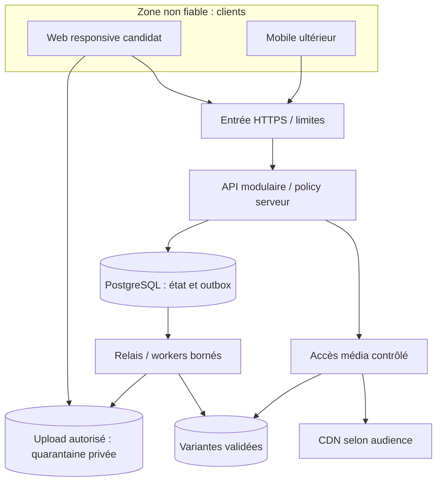
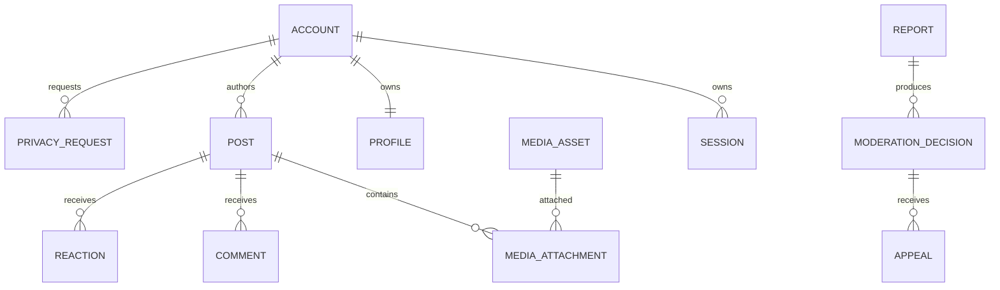

# Proposition d'architecture — Fondation / M0

## Identification et statut

| Champ | Valeur |
| --- | --- |
| Objectif | Choisir une architecture pilote simple et identifier les contrats indispensables avant chaque lot d'implémentation |
| Propriétaire | 03 — Architecture / CTO ; aucun reviewer humain désigné |
| Destinataires | HQ, 01, 04–10, 13–18, 20, 21 ; 19 pour volumes et recrutement |
| Date / révision | 29 septembre 2026 — v0.1 spécialisée pour GitHub |
| Référence examinée | PR [#2](https://github.com/yyogas/social-network/pull/2), branche `documentation/m0-team-coordination`, commit `dd7db8c7aec3ea9779e3fb9a9aadec7b3a732957` |
| Mandat | M0-TEAM-03 ; réponse documentaire à INT-0003 ; instruction reçue dans la discussion 03 |
| Statut | **PROPOSÉ — NON APPROUVÉ POUR IMPLÉMENTATION** ; aucune validation spécialisée externe reçue |
| Priorité / phase | P0 pour les fondations du MVP candidat ; autres phases selon FEAT ci-dessous |
| Périmètre | Frontières, flux, données, sécurité à contractualiser, options de stack/déploiement, résilience et croissance |
| Exclusions | Code applicatif, migrations, configuration de production, fournisseur adopté, budget engagé, capacity/SLA garanti |

Entrées consultées : [mandat](../teams/work-orders.md), [modèle](../teams/deliverable-template.md), [plan documentaire](../documentation-plan.md), [vision](../product/product-vision.md), [catalogue](../product/feature-catalog.md), [parcours](../product/user-journeys.md), [registre HQ](../project-governance/decision-register.md), [coordination](../project-governance/coordination-board.md), [hébergement](../hosting/hosting-comparison.md), [qualité](../quality/test-strategy.md), [contribution](../../CONTRIBUTING.md) et [conventions](../repository-conventions.md).

### Nature des affirmations et réutilisation

- **CONFIRMÉ :** M0 autorise la rédaction ; GitHub est la référence ; MVP et stack restent à arbitrer. Le commit d'entrée contient 42 fichiers documentaires et de contrôle, sans application. Cela décrit ce commit, pas toutes les branches présentes ou futures.
- **PROPOSÉ :** architecture et règles candidates décrites ici, phases du catalogue et recommandations des ADR. La fusion de cette PR n'approuve pas ces choix.
- **À VÉRIFIER :** compétences disponibles, budget, charge, langues, pays, âge, surface de lancement, matrice d'audience, ressources humaines de modération.
- **NON REÇU dans cette revue :** contrats approuvés des équipes 04/08, validations 09/14/15, benchmark et preuve de restauration applicative. Les autres branches non examinées ne sont pas déclarées vides.

Ce livrable reprend les deux brouillons rédigés dans la discussion 03 le 29 septembre : architecture générale v0.1 et Architecture Foundation M0 v0.1. Leur substance utile est intégrée ici ; ils ne sont plus nécessaires pour comprendre la proposition. Leurs IDs provisoires `ADR-M0-001` à `006` sont rapprochés ci-dessous des IDs candidats conformes au dépôt. Aucun statut approuvé n'est transféré. Les corrections de cette reprise sont explicites : ajouter export/suppression, notifications, langues et mesure ; préciser la révocation média ; remplacer la tolérance aux doublons du brouillon par la proposition de pagination conforme à AC-J03-01.

## Besoin, fonctionnalités et parcours

### Contribution indispensable de 03

Permettre aux équipes de savoir quel module écrit chaque état, qui contrôle l'accès, quand une action devient visible, comment elle est reprise après panne et quel contrat consomme chaque interface. Un lot autonome peut avancer après ses arbitrages ; les fonctions futures ne bloquent pas les lots indépendants. Les questions critiques de permissions et de données bloquent uniquement les opérations concernées.

### Carte fonctionnelle et horizons

Les IDs sont ceux du catalogue. Toutes les phases ci-dessous sont **PROPOSÉES**, sans nouvelle fonctionnalité ni modification silencieuse de roadmap. P0/P1/P2/P3 conservent leur sens dans le catalogue.

| Fonctionnalités | Phase / priorité | Contribution architecture et dépendance |
| --- | --- | --- |
| FEAT-001, FEAT-002, FEAT-003 | MVP / P0 | Identity/Profile ; activation, session révocable, récupération et données de profil séparées ; 04/14/15 |
| FEAT-004, FEAT-012 | MVP / P0 | Policy et blocage communs au texte, médias, fil, notifications et actions ; 01/09/14/15 |
| FEAT-005 | MVP / P0 | Relation de suivi unique, reprise idempotente ; audience distincte de l'abonnement ; 01/04 |
| FEAT-006, FEAT-007, FEAT-008 | MVP / P0 | Content/Media/Feed ; état de publication, upload isolé, pagination stable ; 04/05/08 |
| FEAT-009, FEAT-010, FEAT-011 | MVP / P1 | Interactions et notification durable ; règles d'unicité, droits recontrôlés, préférences ; 01/04/09 |
| FEAT-013, FEAT-014, FEAT-015, FEAT-017 | MVP / P0 | Dossier, décision, exécution, recours et habilitations internes distincts ; 09/10/14/15 |
| FEAT-016 | MVP / P0 | Export et suppression orchestrés sur DB, objets, jobs et sauvegardes ; 04/14/15 |
| FEAT-018, FEAT-021 | MVP / P0 | Client candidat responsive, codes d'erreur traduisibles, langues non confondues avec pays ; 02/05/06/16 |
| FEAT-019, FEAT-022 | MVP / P1 | Mesure minimale et repère de fin du fil ; aucun tracking supplémentaire implicite ; 02/13/15 |
| FEAT-020 | MVP conditionnel / P1 | Communities optionnel : membership et pouvoirs locaux ; OPEN-003 doit être tranché |
| FEAT-023 | Phase 2 / P1 | Recherche dérivée avec revalidation des accès ; pas d'OpenSearch obligatoire au pilote |
| FEAT-024, FEAT-025, FEAT-026, FEAT-027, FEAT-028 | Phase 2 / P2 | Messages, mobile natif, vidéo, outils créateurs/professionnels : contrats spécifiques avant mise en œuvre |
| FEAT-029, FEAT-030, FEAT-031 | Phase 3 / P2 | Recommandation, Ads, paiements : finalités, autorisations et données distinctes ; aucun stockage préventif au pilote |
| FEAT-032 | International / P1 | Expansion après revue locale ; primitives de langue/fuseau préparées au MVP |
| FEAT-033, FEAT-034 | Long terme / P3 | Live et API développeur : quotas, révocation, contrôle anti-abus et capacité à démontrer |

### Parcours et états candidats

Les règles sont à faire accepter par leurs propriétaires. Les codes d'erreur ci-dessous sont des catégories conceptuelles : 04 devra fixer les codes HTTP et la politique 403/404 évitant la divulgation d'existence.

| Parcours / FEAT | Acteurs, préconditions et nominal | États et transitions | Erreurs, concurrence et reprise |
| --- | --- | --- | --- |
| J01 / 001–004, 021 | Personne admissible → activation → compte → profil ; langue et conditions approuvées ; connexion puis révocation | Compte en attente → actif ; session active → révoquée/expirée ; suspension selon 09 | `ACTIVATION_EXPIRED`, `SESSION_INVALID`, `RATE_LIMITED` ; activation consommée atomiquement ; réponse de récupération sans existence de compte ; aucune session issue d'un échec |
| J02 / 004, 006, 007 | Auteur habilité choisit audience et texte ; image facultative autorisée puis validée ; confirmation de publication par service | Image autorisée → uploadée → en validation → prête/rejetée ; post en attente → publié ; visibilité, retrait auteur et sanction sont des dimensions séparées | `MEDIA_INVALID`, `MEDIA_NOT_READY`, `IDEMPOTENCY_CONFLICT`, `VERSION_CONFLICT` ; reprise après timeout par clé ; changement concurrent refuse la version périmée ; nettoyage uploads orphelins |
| J03 / 005, 008–012, 022 | Membre suit une personne, lit et interagit sur un contenu accessible ; préférences respectées | Relation absente/présente ; fil vide/chargement/page/fin/échec partiel ; réaction présente/absente ; commentaire visible/retiré | `CURSOR_INVALID`, `RESOURCE_UNAVAILABLE`, `ACTION_FORBIDDEN` ; unicité suivi/réaction ; contrôle avant écriture ; une erreur réseau ne devient pas un succès |
| J04 / 012, 013 | Membre bloque et/ou signale ; règles d'effet et preuve définies ; dossier accusé seulement après commit | Blocage actif/inactif ; signalement reçu/en examen/résolu selon 09 | `TARGET_UNAVAILABLE`, `DUPLICATE_REQUEST` ; objet supprimé ne révèle pas ses données ; politique de preuve à décider ; blocage ne vaut pas sanction |
| J05 / 014, 015, 017 | Opérateur habilité ouvre un dossier, motive une action ; personne concernée peut exercer le recours retenu | Décision enregistrée ; action appliquée/échec ; notification en attente/envoyée/échec ; recours reçu/en examen/résolu | `ROLE_REVOKED`, `CASE_VERSION_CONFLICT`, `DELIVERY_FAILED` ; transaction décision/action si même DB ; notification asynchrone distincte ; annulation ne restaure jamais automatiquement un contenu retiré par l'auteur |
| J06 / 004, 016 | Demandeur vérifié demande export ou suppression et consulte son état | Demande reçue → vérifiée → en traitement → terminée/échec ; suspension de publication pendant suppression à arbitrer | `VERIFICATION_REQUIRED`, `EXPORT_EXPIRED`, `DEPENDENCY_UNAVAILABLE` ; étapes idempotentes et état exact ; suppression ne se dit complète qu'après contrôle de chaque cible requise |
| J07 / 020 conditionnel | Candidat/membre/responsable agit dans une communauté retenue ; rôles et types approuvés | Demande/adhésion/refus/départ/exclusion ; fermeture ; retrait de rôle | `MEMBERSHIP_REQUIRED`, `LAST_OWNER_CONFLICT` ; règles du dernier responsable non inventées ; suppression de rôle invalide les actions suivantes |

UX et accessibilité : 02 possède écrans, messages, focus et navigation ; 05/06 consomment des statuts et erreurs stables, traduisibles et sans secret. Proposer un état consultable après interruption, une alternative texte pour l'image (FEAT-007), un état vide réel, et aucune notification de réussite avant confirmation serveur. Les brouillons locaux/offline et leur conservation nécessitent 15 ; pas de synchronisation offline métier implicite.

## Options et architecture logique

### Comparaison des formes d'architecture

| Option | Avantage pour le pilote | Coût / limite | Migration et position proposée |
| --- | --- | --- | --- |
| A — monolithe modulaire, API + workers | Une transaction pour invariants ; frontières de modules ; processus dimensionnables séparément | Déploiements couplés ; discipline de propriété des données | **Recommandé à examiner** ; extraire ultérieurement un module implique contrat, données et migration |
| B — application intégrée web/backend | Moins de surfaces à exploiter si web seul ; composition simple | Contrat mobile et workers à stabiliser ; risque de mélanger présentation et métier | Alternative ouverte ; comparer si équipe essentiellement web |
| C — microservices initiaux | Isolation de déploiement et ressources par domaine | Coordination, cohérence distribuée, observabilité et astreinte supplémentaires | Non recommandé pour M0 sans besoin démontré ; aucun rejet officiel |

### Comparaison de stacks candidates

Cette comparaison est une analyse de conception, **pas un benchmark ni un choix de versions**. 20 et 14 doivent vérifier maintenance, compatibilité, licences et versions supportées avant adoption ; 04/05/06 doivent confirmer les compétences réelles. Aucun coût de recrutement n'est chiffré.

| Option | Critères favorables | Contraintes et preuve attendue | Recommandation |
| --- | --- | --- | --- |
| Next.js + NestJS / TypeScript | Correspond à la stack envisagée ; séparation web/API ; vocabulaire TypeScript partagé | Deux applications à exploiter ; droits exclusivement serveur ; jobs lourds isolés ; confirmer expérience et tests de contrats | Candidat prioritaire à comparer, sans adoption |
| Next.js avec backend intégré | Réduit le nombre d'applications pour web seul | Documenter API indépendante du rendu, workers, session et compatibilité future mobile | Alternative pour pilote très limité |
| Web + Laravel/PHP ou Django/Python modulaire | Alternative cohérente si compétences dominantes dans l'équipe | Maintien de contrats avec TypeScript/Dart ; changement de stack à arbitrer ; aucune supériorité de performance présumée | À retenir dans la comparaison si compétences le justifient |
| Web responsive / PWA | Une surface candidate pour FEAT-018 ; test rapide des parcours | Limites caméra/push/offline à examiner par 06 à partir de sources officielles ; installation non garantie | Responsive proposé ; PWA option, non exigence |
| Flutter/Dart natif | Stack mobile envisagée, pertinent si besoin de client installé confirmé | Deux écosystèmes de développement, stores et compatibilité API ; preuve de valeur par 06 | FEAT-025 Phase 2 selon catalogue, révisable par HQ |

PostgreSQL proposé pour état transactionnel ; objet compatible S3 pour binaires ; CDN pour diffusion selon policy. Redis, OpenSearch, ClickHouse, Python IA et WebSocket sont candidats par besoin, sans obligation de les déployer M0. Docker est un candidat de packaging reproductible ; Kubernetes est une option de croissance, sans adoption. Les recommandations restent indépendantes du fournisseur d'hébergement.

### Diagramme logique proposé

Le client obtient son autorisation d'upload de l'API ; la flèche d'upload ne confère aucun droit permanent. Le relais lit l'outbox ; une file dédiée est optionnelle. Une URL signée non expirée n'offre pas, à elle seule, une révocation immédiate. Les médias restreints nécessitent un contrôle de policy à chaque requête via gateway/edge autorisé ou un autre contrat de révocation approuvé par 08/14/15. Une URL jamais publique et un origin privé réduisent le contournement. Ce diagramme ne garantit pas de haute disponibilité.

### Responsabilités, stockage et flux

| Domaine | Écritures possédées | Lecteurs / consommateurs | Frontière et cohérence |
| --- | --- | --- | --- |
| Identity/Profile | compte, session, profil | Policy, clients, support autorisé | secrets séparés du profil exposé ; réauthentification/revocation selon 14 |
| Graph/Communities | suivi, blocage, membership éventuel | Policy, Feed | suivi ne confère pas automatiquement un droit de lecture |
| Content/Interactions | texte, audience, version, retrait, réactions/commentaires | Feed, Media, modération | revalider droit à l'écriture ; unicité DB des opérations qui l'exigent |
| Policy | règles évaluées, pas copie indépendante des comptes/posts | tous les chemins de lecture/action | interfaces vers états métier ; deny sur incertitude d'accès, pas de cache positif périmé |
| Media | upload, objets, variantes, statut/purge | Content, gateway média | quarantaines non publiques ; ownership de chaque attachement vérifié |
| Moderation/Appeals | signalements, décisions, exécution et recours | admin autorisé, demandeur selon champs | pouvoirs dossier/contenu distincts ; vues minimisées |
| Notifications | inbox, préférences, tentatives d'envoi | clients, expéditeur technique | événement reçu n'autorise pas l'aperçu ; revalidation à l'envoi et à la lecture |
| Privacy requests | états d'export/suppression et étapes | demandeur, opérateur habilité | orchestrer chaque propriétaire ; aucune purge implicite via cascade globale |
| Operations / Data | audit restreint et métriques minimales | 14 ; 13 pour agrégats autorisés | audit, produit analytique et logs ne sont pas un magasin unique |

Le modèle physique appartient à 04 en coordination avec 03/13/15. Pas de SQL libre entre modules ; une interface de lecture optimisée peut regrouper les vérifications transactionnelles sans déplacer la responsabilité. Policy évalue des faits fournis via interfaces, ne rappelle pas les méthodes de commande qui l'appellent : éviter une dépendance circulaire. Une transaction peut englober plusieurs composants du monolithe sous orchestration explicite.

Diagramme conceptuel partiel, pas DDL : auteurs des commentaires/réactions, cible typée de signalement, suivi/blocage, outbox et membership restent à détailler par 04. La cardinalité autorisée des attachements et réutilisation d'images est ouverte ; le dessin ne l'approuve pas.

## Permissions, données et contrats

### Matrice d'autorisation candidate

| Acteur / état | Action / ressource | Portée proposée et refus |
| --- | --- | --- |
| Anonyme | lire profil/post/média | seulement audience explicitement autorisée ; défaut d'audience NON REÇU ; pas d'existence privée dans réponse |
| Compte actif | suivre, lire, interagir | état du compte, ressource, audience, blocage, membership si retenu ; refus si règle manque |
| Propriétaire | modifier/retirer son profil ou contenu | propriété vérifiée serveur ; version attendue ; aucune élévation de droits par champ soumis |
| Autre utilisateur | modifier objet d'autrui | refus même si ID connu ; pas de confiance dans masquage du bouton |
| Bloqué | lire ou interagir | effet exact selon matrice 09/15 ; tous canaux doivent appliquer cette même matrice ; pas de promesse d'invisibilité d'un contenu déjà public |
| Suspendu | écrire, lire paramètres ou faire recours | capacités résiduelles à définir par 09/15 ; un refus de publication ne ferme pas arbitrairement les droits d'export/recours |
| Modérateur / support | lire preuve, décider, assister | permissions distinctes et limitées au dossier ; rôle local ne devient pas rôle global ; contrôle à chaque action |
| Worker / service | traiter image, notifier, purger | identité de service limitée ; événement interne ne vaut pas autorisation ; vérifier l'état courant avant effet |

Courses d'autorisation : pour écriture concurrente avec blocage/retrait, 04/14 doivent définir un point d'ordre transactionnel (verrou/version de policy partagé par les opérations concurrentes, ou mécanisme équivalent). Une vérification suivie d'une écriture hors transaction est insuffisante. Garantie proposée : toute opération ordonnée après le commit de restriction est refusée ; une opération concurrente est sérialisée ou rejetée. Pour lectures, une réponse déjà en vol ou des octets déjà reçus ne peuvent être repris ; aucun cache ne doit permettre une nouvelle requête interdite après la borne de révocation approuvée. 01/08/14/15 doivent fixer cette borne et les canaux concernés.

### Données et cycle de vie

Aucune durée n'est inventée : 15 fournit conservation, exceptions, effacement et effet des sauvegardes ; 14 définit chiffrement, clés et accès. Valeurs de pays légal, résidence, origine, communauté et langues restent distinctes ; aucune inférence automatique d'identité culturelle.

| Catégorie / origine | Finalité, champs minimaux proposés | Stockage / visibilité / accès | Modification, export, retrait et sauvegarde |
| --- | --- | --- | --- |
| Compte/session / utilisateur et auth | ID, état, méthode de contact retenue, session/révocation | PostgreSQL ; jamais secrets dans profil ni logs ; 04/14 | rotation/révocation ; export exclut secrets ; suppression orchestrée ; réappliquer révocations après restauration |
| Profil/relations / utilisateur | nom affiché, description facultative, avatar, suivis/blocages | PostgreSQL + objet avatar ; visibilité champ par champ ; 01/15 | modifier sous version ; tiers minimisés dans export ; purge/dissociation selon policy |
| Contenu/image / auteur | texte, audience, timestamps serveur, version, alt, références variantes | DB + objets ; média et miniature héritent de l'autorisation ; 01/08 | retrait logique puis purge traçable ; originaux/métadonnées et sauvegardes traités explicitement |
| Interactions / membres | auteur, ressource, type/réaction, texte commentaire | DB ; visibilité héritée sous réserve des règles 09 | compteurs et fils recalculés ; export selon tiers ; retrait n'efface pas silencieusement une preuve légalement conservée |
| Dossiers / signalant et opérateurs | cible, catégorie, preuve autorisée, décision/motif, recours | DB/objet de preuve isolé ; 09/10 ; accès restreint audité | correction tracée ; disclosure/export et conservation à faire revoir par 15 ; aucune identité de signalant dans vue de cible |
| Notifications / événements | destinataire, catégorie, référence d'objet, statut | DB ; détail revalidé à la lecture ; prestataire seulement si adopté | déduplication ; préférences ; effacement et expiration coordonnés |
| Outbox/jobs / transactions | ID, type/version, référence, corrélation, tentatives | DB puis transport éventuel ; minimum de données, pas de texte privé par défaut | rétention de replay bornée ; ignorer effet tardif si contenu supprimé ; tombstone de suppression selon 15 |
| Mesure/audit / activité système | métriques agrégées et trace minimale des actions sensibles | stockage à décider avec 13/14/15 ; accès par finalité | collecte minimale, échantillonnage, purge et export différenciés ; pas de SDK activé |
| Export/suppression / demandeur vérifié | demande, étapes, références d'export, statut | DB + export privé temporaire ; accès demandeur seul selon contrat | lien à expiration et revalidation ; reprise étape par étape ; registre de suppression recontrôlé avant réouverture après restauration |

### Contrats candidats et politique commune

Les identifiants locaux `C03-01` à `C03-08` servent uniquement de repères de revue, pas de registre API officiel. 04 attribuera les IDs/version d'API. Version documentaire candidate : `0.1`. **Statut de tous les contrats : PROPOSÉ, schémas exécutables NON REÇUS.**

Règles communes à faire approuver : validation stricte des champs et longueurs ; erreurs sûres avec `request_id` ; authentification/sessions choisies par 14 ; policy d'objet/action ci-dessus ; réponses privées non mises en cache partagé ; limites de charge et taille à fixer avant exposition. Aucun retry automatique d'écriture non idempotente. Clé d'idempotence liée à acteur/opération/hash d'entrée, refus si réutilisation avec entrée différente, résultat stable pour un replay ; fenêtre de conservation à fixer. Mutation versionnée avec conflit explicite. Timeouts chiffrés, quotas et backoff NON REÇUS de 04/14 : ils bloquent l'approbation du contrat concerné, pas sa rédaction. Corrélation HTTP → transaction → outbox → job ; événements sans secrets. Compatibilité additive puis rupture versionnée ; durée de support clients à décider avec 05/06. Tests ci-dessous PLANNED.

| Repère / producteur → consommateur | Entrée → sortie conceptuelles | Auth / permission | Erreurs, retry, concurrence, dépendance |
| --- | --- | --- | --- |
| C03-01 / 04 Identity → 05/06/10 | activation/session/révocation → acteur, état, résultat sûr | activation contrôlée ; récupération vérifiée ; support limité | token expiré/consommé, rate limit ; aucune reprise créant session indue ; test AC-J01-01 à 04 |
| C03-02 / 04 Graph/Profile → 05/06/Feed | cible, action, version → relation/profil autorisé | acteur actif ; visibilité champs ; ownership | cible non accessible ; contrainte d'unicité, retry même intention ; AC-J03-03 et AC-J04-01 |
| C03-03 / 08 Media + 04 Content → 05/06 | fichier déclaré, alt, audience, clé, texte → upload limité, état média, ID/version post | propriétaire autorisé ; contrôle avant attachement/publication | type réel/quotas ; upload interrompu expire ; worker borné, quarantine en panne ; aucun succès anticipé ; AC-J02-01 à 05 |
| C03-04 / 04 Feed → 05/06 | curseur opaque, page bornée → posts admissibles, prochain curseur, fin | lecteur courant ; policy pour chaque objet | curseur invalide/expiré ; lecture rejouable ; pas de résultat privé de fallback ; AC-J03-01/02 |
| C03-05 / 04 Interactions/Notifications → 05/06/10 | objet/action/clé ou préférence → état durable | recontrôle droit avant write/envoi/lecture | conflit d'état, delivery failed ; notification durable puis envoi dédupliqué ; AC-J03-02/03/05 |
| C03-06 / 04 sous règles 09 → 10/05 | signalement/décision/version/recours → dossier et état autorisé | permissions dossier, preuve, décision, recours distinctes | course entre opérateurs ; commit décision/effet et audit ; notification séparée ; AC-J04-02 à 04, AC-J05-01 à 05 |
| C03-07 / 04 Privacy → 05/10/08/14 | demande vérifiée → étapes/état/export autorisé | demandeur ou opérateur strictement habilité | dépendance en échec ; retry borné par étape ; aucun retour « supprimé » prématuré ; AC-J06-01 à 04 |
| C03-08 / modules 04/08 → workers/13/14 | enveloppe événement → accusé technique et effet enregistré | identité de service limitée ; relecture état courant | au moins une fois ; déduplication consumer+event ; outbox commit atomique ; DLQ/rejeu contrôlé ; AC-ARCH-03/04 |

Enveloppe événement candidate : `event_id`, `type`, `schema_version`, `aggregate_id`, `aggregate_version`, `occurred_at`, `correlation_id`, références minimales. Types à négocier : contenu publié/restriction/retrait, média prêt/rejeté, blocage modifié, décision appliquée, demande privacy progressée. Ordre global non requis ; ancien événement ne doit pas rétablir une ressource retirée. Relais avec lease et reprise après crash ; l'accusé technique ne prouve pas l'effet utilisateur. File éventuelle Redis/BullMQ ou autre : 04/14 comparent persistance, replay, coût et exploitation avant adoption.

### Pagination proposée pour FEAT-008

Ordre immuable à première publication `(published_at DESC, id DESC)`, borne supérieure du premier appel, suite strictement inférieure au dernier candidat parcouru. Retenter le même curseur donne une page à dédupliquer par ID côté client ; avancer le curseur ne redonne pas les IDs déjà traversés. Changements d'audience/blocage revalidés à chaque page ; pas de promesse de snapshot d'accès ancien. Si tous les candidats d'un lot sont filtrés, avancer le curseur avec travail borné et distinction page vide/fin réelle. Un refresh démarre une nouvelle session de lecture. 01/02/04 doivent approuver les effets d'un nouveau suivi ou d'une restauration de post pendant pagination ; pas de changement de timestamp permettant de doubler une publication dans la session.

## Résilience, hypothèses de charge et croissance

| Dépendance / panne | Impact réel | Mesure proposée / responsable |
| --- | --- | --- |
| Hôte unique app + DB | Arrêt du pilote et risque commun de perte | Scénario minimal du comparatif : option explicite, restauration hors hôte, limite de risque à accepter par HQ/14 ; pas de HA annoncée |
| DB unique séparée | API multiple n'évite pas l'arrêt métier | Backup/restauration testés ; réplication/failover ultérieurs avec fencing, choix 14 |
| Worker / relais | Média/notification/effacement en retard | Outbox durable, mesure âge du plus ancien job, leases et reprise ; aucun statut final artificiel |
| Stockage / CDN / gateway | Upload ou accès média indisponible ; gateway peut être SPOF | État d'attente, limites de concurrence ; autorisation échouée = refus ; copie et restauration des médias selon 08/14 |
| Cache / queue optionnels | Perte de présence/cache ou retard jobs | Cache non autoritatif ; intent durable en DB ; admission bornée pour ne pas submerger DB en fallback |
| Fournisseur contact optionnel | Activation/récupération/notification retardées | Expiration et renvoi contrôlé ; état exact ; prestataire et contrat à décider |
| Audit de décision indisponible | Action privilégiée sans preuve | Trace transactionnelle ; refuser l'action si sa trace requise ne peut être durablement enregistrée |

Mesurer latence p50/p95/p99, erreurs, saturation, verrous/connexions DB, âge outbox/jobs, échecs média, coûts sortants et restauration. Health/readiness ne doivent pas exposer secrets ; pas de logs bruts de contenus/sessions ; SLO/RPO/RTO appartiennent à 14 avec 01/HQ et restent proposés.

Hypothèses de test **NON BENCHMARKÉES**, reprises du comparatif HQ sans validation de ses prix ni achat : pilote 1 000 comptes/100 actifs jour/20 sessions/10 req/s ; intermédiaire 10 000/2 000/200/100 req/s ; niveau supérieur 100 000/20 000/2 000/1 000 req/s. Mix proposé 90 % lectures/10 % écritures, à ajuster avec 13/19. Taille du graphe, posts par compte, distributions chaudes, taux de blocage, taille d'image et rafales manquent : 18/14 doivent compléter avant mesure. « Millions d'inscrits » ne suffit pas à dimensionner.

Plan : requêtes/index et pool de connexions mesurés → séparation DB/worker si goulot → réplicas API et contrôle de surcharge → projections/partitionnement ciblés → extraction d'un domaine si profil de charge, contrat et responsabilité d'exploitation le justifient. Coûts de migration à chaque étape : double lecture temporaire, backfill, comparaison, rollback, version de contrat et effacement des anciennes copies. Kubernetes, sharding et multi-région demandent un ADR spécifique et une preuve de nécessité. Les seuils d'alerte du comparatif déclenchent une revue, pas un autoscaling obligatoire ni une capacité garantie.

## Fiches de décisions structurantes proposées

IDs candidats `ADR-0301` à `ADR-0307` : pas de collision trouvée au commit d'entrée ; allocation à confirmer par HQ/17 avant intégration. Toutes sont **PROPOSÉES** le 29 septembre 2026, P0 pour choix liés au MVP (ADR-0307 P1), sans alternative officiellement rejetée. Autorité : HQ après avis 03, des propriétaires ci-dessous et 21. Priorité n'est pas approbation.

| ID / correspondance ancien brouillon | Objectif / contexte / problème | Décision candidate et justification | Alternatives et motifs de préférence | Dépendances / risque | Impacts business et technique / réexamen |
| --- | --- | --- | --- | --- | --- |
| ADR-0301 / ADR-M0-001 | Pilote opérable avec équipe limitée, capacité inconnue | Monolithe modulaire API+workers ; conserver transactions simples et frontières | Application intégrée à comparer ; microservices non préférés sans besoin prouvé | 04/14/20/21 ; couplage et discipline | Moins de coordination distribuée présumée ; migrations/extraction ultérieures ; revoir si équipes ou SLO indépendants |
| ADR-0302 / ADR-M0-002 | Une vérité pour droits et états | PostgreSQL autoritatif ; objets séparés ; caches dérivés | Plusieurs DB métier accroissent réconciliation ; pas de choix NoSQL par défaut | 04/08/14/15 ; DB SPOF | Coût et maintenance à mesurer ; répliques ne doivent pas servir un droit périmé ; revoir sur goulot mesuré |
| ADR-0303 / ADR-M0-003 | Fil prévisible sans recommandation requise | Lecture chronologique bornée, tuple immuable et revalidation | Fanout plus complexe en écriture ; recommandation Phase 3 | 01/02/04/18 ; graphe dense | Règle compréhensible ; coût lecture à tester ; revoir si p95/coût dépassent objectif approuvé |
| ADR-0304 / ADR-M0-004 | Ne pas exposer un upload non validé | Quarantaine et worker ; publication après validation ; accès média suit audience | Proxy API upload possible si contraintes ; diffusion directe privée insuffisante pour révocation forte | 08/14/15 ; octets déjà diffusés irrécupérables | Coût stockage/traitement/gateway ; purge des dérivés ; revoir avec limites et contrat révocation |
| ADR-0305 / ADR-M0-005 | Même permission sur toutes les surfaces | Policy serveur commune ; ordre transactionnel restrictions/écritures | Filtrage client ou index seul non recommandé : contournement/retard | 01/09/14/15/04 ; contention | Confiance et protection ; coût requêtes/verrous ; revoir seulement avec preuve équivalente |
| ADR-0306 / ADR-M0-006 | Ne pas perdre un effet après commit | Outbox et consommateur idempotent ; intent durable | Appel direct peut perdre événement ; broker seul ne ferme pas le double write DB | 04/08/14/18 ; duplication/replay | Reprise explicable ; stockage/ops supplémentaires ; revoir besoin transport/relecture |
| ADR-0307 / nouveau | Choisir stack selon équipe et pilote | Comparer TypeScript Next.js/NestJS candidat prioritaire aux alternatives intégrées et Laravel/Django ; mobile selon OPEN-002 | Pas de rejet avant inventaire compétences et contraintes | 04/05/06/14/20 ; mauvais choix d'équipe | Coût maintenance/recrutement inconnu ; aucune version choisie ; revoir après avis 20 et périmètre |

Delta demandé : après arbitrage explicite, HQ enregistrera les ADR acceptés et leur périmètre dans le registre et le dossier de décisions. Ce document ne modifie pas DEC-0001/0002 ni OPEN-001 à OPEN-008. Les décisions d'authentification, rétention, permissions et fournisseur ne sont pas prises ici.

## Acceptation et vérification

Les critères des parcours restent canoniques dans [user-journeys](../product/user-journeys.md). Les ajouts ci-dessous sont des critères d'architecture, pas des fonctionnalités nouvelles. IDs de test réservés à 18, **NON ATTRIBUÉS** ; statut **PLANNED**. Exécution applicative bloquée par contrats et code absents dans le périmètre examiné.

| Critère | FEAT / parcours | Scénario observable | Type prévu / propriétaire / blocage |
| --- | --- | --- | --- |
| AC-ARCH-01 | 004/007/012, J02/J04 | Restriction confirmée, puis nouveau GET texte, miniature, média direct ou notification : refus selon borne approuvée ; aucun origin de contournement | API/E2E/sécurité, 08/14/18 ; borne non reçue |
| AC-ARCH-02 | 006/010/012, J03 | Blocage concurrent à commentaire : ordre sérialisé défini ; write postérieur à restriction refusé sans ligne ajoutée | Intégration/concurrence, 04/18 ; protocole transactionnel |
| AC-ARCH-03 | 006/007/011, J02/J03 | Crash après commit avant envoi : relais reprend ; pas de publication/notification métier en double | Intégration/panne, 04/18 ; outbox non implémentée |
| AC-ARCH-04 | 007/016, J06 | Événement média prêt rejoué après suppression : aucun contenu ou fichier réexposé | Intégration/privacy, 08/15/18 ; tombstone/rétention |
| AC-ARCH-05 | 008/022, J03 | Deux dates égales, nouvelles publications, retraits et page entièrement filtrée : ordre stable, pas de doublon entre pages avancées, fin exacte | API/concurrence, 04/18 ; contrat curseur |
| AC-ARCH-06 | 014/015/017, J05 | Rôle retiré et deux décisions concurrentes : refus/conflit explicite ; état, effet, audit et notification distingués | API/intégration, 09/10/18 ; permissions |
| AC-ARCH-07 | 016, J06 | Restauration d'une sauvegarde antérieure à effacement : opérations de réconciliation terminées avant réouverture, aucune donnée interdite ressuscitée | Exercice restauration, 14/15/18 ; plan non reçu |
| AC-ARCH-08 | 001/002, J01 | Activation rejouée/récupération invalide/session révoquée : pas de second compte, secret ou accès privé | API/sécurité, 04/14/18 ; auth |
| AC-ARCH-09 | 019/021, J01–J06 | Logs et événements inspectés avec fixtures : aucune donnée interdite ; erreur possède code traduisible et corrélation sûre | Contrats/intégration, 13/16/18 ; schémas |
| AC-ARCH-10 | 020, J07 | Membre perd son rôle : action locale suivante refusée ; aucun pouvoir global obtenu | API/permissions, 09/14/18 ; inclusion conditionnelle |

Contrôles documentaires réellement exécutés et limitations : voir le [rapport de cette contribution](architecture-validation.md). Aucun résultat applicatif PASS ni benchmark n'est déclaré.

## Dépendances, risques et transmission

Réutiliser INT-0003 comme demande mère, INT-0001/0004/0005/0008/0009/0010 et OPEN-001 à 008 comme références existantes. Les lignes ci-dessous sont des deltas à transmettre, pas de nouvelles allocations d'INT. **Toutes les transmissions sortantes restent À TRANSMETTRE** ; la publication GitHub ne prouve pas réception dans les discussions.

| Référence / destinataire depuis 03 | Question et pièce attendue | Bloque / n'empêche pas |
| --- | --- | --- |
| INT-0001, OPEN-002/003 → 01/HQ, 05/06 | Confirmer variante de périmètre et valeur de communautés ; devis d'effort/surfaces par équipes | Schéma membership et clients ; n'empêche pas contrats communs |
| INT-0004, OPEN-007 → 09/10/14 | Matrice lecture/action/blocage/suspension/recours ; états et ordre des décisions | Policy/console ; n'empêche pas inventaire états |
| INT-0005, OPEN-001/004/007 → 15/16 | Âge, pays, langue, champs, retention/export/effacement, borne de retrait média | Données et accès concernés ; n'empêche pas cartes de flux |
| INT-0003, OPEN-005 → 04/08 | Répondre C03-01 à 08 : schémas, limites, délais, idempotence, ownership et retrait d'images | Approbation des contrats ; n'empêche pas brouillons producteurs/consommateurs |
| INT-0003, OPEN-005/006 → 14/13/19 | Compétences, charge réaliste, budget, RPO/RTO et disponibilité humaine | Dimensionnement/SLO ; n'empêche pas comparaison des options |
| INT-0008 → 18 | Relier AC-ARCH et AC-J aux tests et préciser protocole de charge/panne | Preuves de release ; pas la rédaction |
| INT-0010, INT-0006/0007 → 17/20/21 | Vérifier IDs, conventions, delta et revue indépendante | Intégration/fusion ; pas les propositions |

Risques existants : RISK-0001 (inflation), RISK-0002 (modération), RISK-0003 (international), RISK-0004 (contrats incohérents). Les sous-cas suivants enrichissent leur instruction sans inventer une entrée officielle HQ.

| Sous-cas / référence | Impact et propriétaire | Mesure / état |
| --- | --- | --- |
| Fuite média/cache — RISK-0004 | Critique, 08/14/15 | Contrat révocation, origin privé et tests multi-canaux ; OUVERT |
| Décision sans recours/rôle défini — RISK-0002 | Critique pour lancement, 09/10/15 | États et ressources humaines réels ; OUVERT |
| Événement périmé réintroduisant un effacement — RISK-0004 | Élevé, 04/08/15 | Revalidation/version/tombstone et test restauration ; OUVERT |
| Hôte/DB uniques — RISK-0004 | Élevé, 14/HQ | Acceptation explicite du risque, restauration hors hôte mesurée ; OUVERT |
| Surcoût de tous les composants envisagés — RISK-0001 | Élevé, 03/14/HQ | Composants introduits sur besoin ; budget non reçu ; OUVERT |

### Contradictions et écarts ciblés

1. Brouillon antérieur 03 exigeait PostgreSQL géré et plusieurs processus comme installation initiale ; le comparatif HQ envisage DB/hôte commun. **Options différentes, aucune validée.** Ce document rend le choix explicite, avec SPOF et responsabilité 14/HQ ; ne réécrit pas le comparatif.
2. Brouillon antérieur 03 limitait les notifications aux recours et détaillait peu export/effacement/langues ; le catalogue propose FEAT-011/016/019/021. Couverture ajoutée ici, périmètre exact toujours Produit/Privacy ; aucun déclassement implicite.
3. Brouillon 03 admettait des doublons de pagination ; FEAT-008 et AC-J03-01 demandent leur absence dans les scénarios définis. Proposition corrigée dans la section pagination ; 04/18 doivent vérifier les cas concurrents.
4. « Retrait immédiat » et URL privée signée sont insuffisamment compatibles sans contrôle d'accès supplémentaire. Borne de révocation à décider dans OPEN-007 avec 08/14/15 ; pas de promesse d'effacer les octets déjà copiés.
5. Le modèle antérieur décrivait Policy comme dépendance bidirectionnelle potentielle de Content. Ici, séparer accès aux faits et commandes ; revue 04/21 nécessaire avant interfaces définitives.

## Compte rendu de fin d'étape

1. **Décisions prises / à valider :** organisation locale de ce livrable et réemploi des FEAT ; ADR-0301 à 0307 proposés au HQ, aucun changement de stack/permissions adopté.
2. **Livrables :** ce document, l'index de domaine et le rapport de contrôles ; branche/PR et SHA de publication indiqués dans le compte rendu GitHub. La base examinée est dd7db8c7aec3ea9779e3fb9a9aadec7b3a732957.
3. **Vérification :** contrôles documentaires dans le rapport lié ; critères applicatifs PLANNED, pas de test applicatif exécuté.
4. **Questions :** OPEN-002/003/005/007 prioritaires pour les contrats, OPEN-001/004/006 pour pilote et exploitation.
5. **Dépendances :** deltas du tableau ci-dessus ; réponses externes non reçues dans cette revue ; transmissions À TRANSMETTRE.
6. **Risques :** fuites par accès secondaires, effacement/rejeu, permissions de recours et SPOF ; aucune capacité validée.
7. **Suite / HQ :** examiner ce delta avec 14/15/21 ; demander réponses ciblées 04/08/01/09 ; arbitrer les ADR et le périmètre du lot ; 17 normalise les références ; 20 implémente seulement les contrats suffisamment validés et autorisés. Revue avant fusion. Retour arrière documentaire par revert ciblé en préservant les contributions suivantes.
