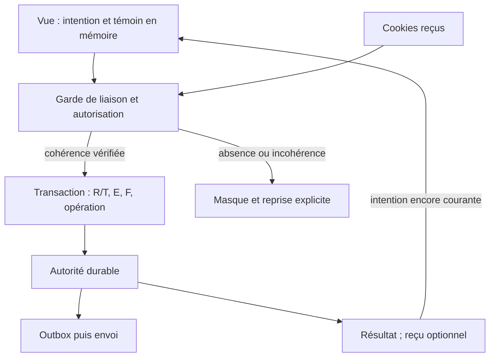
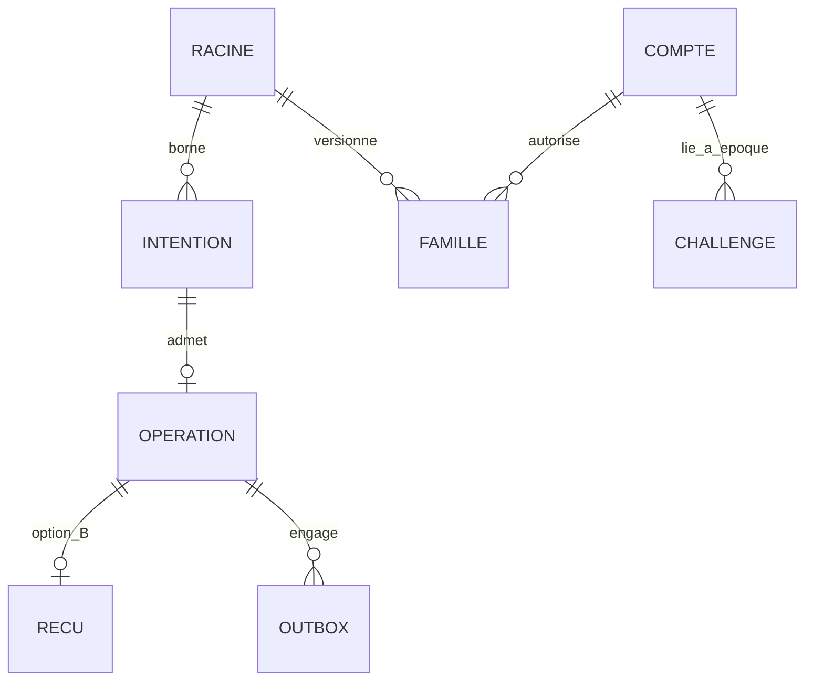

# L1 — primitives de session, concurrence et reprise — Architecture v0.1

## 1. Identification et statut

| Champ | Valeur |
| --- | --- |
| Propriétaire | 03 Architecture ; auteur de la proposition, pas autorité d'approbation transversale |
| Date | 30 septembre 2026 |
| Mandat | §11 du cadrage HQ ; quatre premiers groupes uniquement, contraintes de conservation et de droits en dépendance |
| Statut | PROPOSÉ / EN REVUE ; L1 reste BLOQUÉ POUR CODE |
| Classement | MVP proposé, P0 : empêcher mauvaise attribution d'identité, résurrection de session ou double mutation |
| Livrable | Delta documentaire ; aucune modification du contrat propriétaire Backend, aucun code, aucune migration |
| Non reçu | Arbitrage HQ sur les options ci-dessous ; relecture de ce delta par 04/05/14/15/18 ; raccordement des droits 09/10/15 |
| À vérifier | Faisabilité navigateur, stockage autoritatif, modèle de panne et paramètres ; aucune preuve runtime disponible |

**CONFIRMÉ** : mandat et références reçus. Les avis ci-dessous examinent tous le Backend au SHA `1acf84fffcaa8131c0826d4874126e107a4cf978`. Leur réception ne vaut pas validation du protocole. Toutes les garanties décrites ensuite sont des exigences ou options **PROPOSÉES**, pas des propriétés d'une implémentation existante.

### Sources figées et réemploi

- [HQ §11, PR #27](https://github.com/yyogas/social-network/blob/4d3cd079e92217936af3292429a38f91f7b576ff/documentation/project-governance/m0-mvp-arbitration.md), SHA `4d3cd079e92217936af3292429a38f91f7b576ff` : base du delta.
- [Backend #28](https://github.com/yyogas/social-network/pull/28), SHA examiné `1acf84fffcaa8131c0826d4874126e107a4cf978` : delta propriétaire L1 v0.2, L1-CTX et API-BE-001/002/003/005/006/007/049. Les conclusions ne s'étendent pas automatiquement à un amendement ultérieur.
- [Web #29](https://github.com/yyogas/social-network/blob/e363e751d4b797cceb6c6ab3ec79745d6e54e380/documentation/web-application/backend-l1-web-review.md), SHA `e363e751d4b797cceb6c6ab3ec79745d6e54e380`.
- [Sécurité #30](https://github.com/yyogas/social-network/blob/3221f762b5f98a552a3600fc24118fbe99b7a003/documentation/security/backend-l1-security-review.md), SHA `3221f762b5f98a552a3600fc24118fbe99b7a003`.
- [Privacy #31](https://github.com/yyogas/social-network/blob/81063238cd32689c630aaa1e70633b7104a48042/documentation/privacy/backend-l1-targeted-review.md), SHA `81063238cd32689c630aaa1e70633b7104a48042`.
- [QA #32](https://github.com/yyogas/social-network/blob/cada61a7b6391a1119bfdf70b4ddc7b04ab13dbb/documentation/quality/backend-l1-qa-review.md), SHA `cada61a7b6391a1119bfdf70b4ddc7b04ab13dbb`.
- [Architecture existante et ADR candidats](https://github.com/yyogas/social-network/blob/4d3cd079e92217936af3292429a38f91f7b576ff/documentation/architecture/architecture-proposal.md) : préciser ADR-0301, ADR-0302, ADR-0305, ADR-0306 ; conserver ADR-0307 et la stack ouverts. Aucun nouvel identifiant de constat concurrent.

La proposition ne réexamine ni le MVP métier ni les avis complets. Les amendements non traités restent à charge de 04 au titre du §11 ; aucune ligne source n'est fermée ici.

## 2. Décision demandée : garanties et limites avant mécanismes

**Recommandation : instruire d'abord l'option A, avec reprise utilisateur explicite et transactions dans une autorité unique ; ne retenir les éléments de B que si leur bénéfice de reprise est demandé et leur coût validé.** A implique une reconnexion après perte de l'état de vue, y compris un reload. Ce coût UX doit être arbitré par HQ/05, pas imposé par Architecture. A ne satisfait pas, à elle seule, la garantie globale « le dernier login du navigateur invalide tous les précédents » entre racines indépendantes. B ne la démontre pas non plus tant que son amorçage commun n'est pas établi.

Une racine serveur aléatoire n'est pas une identité de navigateur. Si deux amorçages sans cookie commun créent C1 et C2, le serveur ne sait pas qu'ils appartiennent au même navigateur. L'ordre d'arrivée des cookies n'est ni un CAS ni l'ordre de commit serveur. Vérifier une paire cohérente ne permet pas de reconnaître qu'une ancienne paire cohérente C1/S1 est revenue après C2/S2. IP, empreinte du navigateur, verrou JavaScript et message inter-onglets ne constituent pas la preuve d'une racine commune.

**Arbitrage bloquant** : soit HQ/05/14 acceptent explicitement une garantie bornée à la racine/session connue avec reprise stricte, soit 03/04 doivent fournir et faire revoir un mécanisme supplémentaire d'établissement de racine et sa preuve sous doubles amorçages/pertes. Dans l'intervalle, ne pas affirmer que Web B04 / S14-L1-05 / QA-B sont résolus. Cette limite est architecturale, pas une invitation à relâcher silencieusement le contrat.

| Dimension | A — reprise explicite minimale | B — contexte persistant et reçu ciblé |
| --- | --- | --- |
| État client | Cookie de session candidat ; témoin de vue/intention en mémoire seulement ; admission préauth éphémère | Cookie de contrôle distinct, contexte serveur borné, génération et reçu après fin de session ; témoin de vue toujours nécessaire |
| Attribution du login | Réponse reçue et liée à l'intention courante ; réponse perdue : résultat inconnu, nouvelle authentification explicite | Même règle ; un reçu peut confirmer une transition exacte, jamais transformer une lecture de session courante en résultat d'un ancien login |
| Reload/perte d'état | Écran neutre, authentification fraîche requise avant tout privé ; pas de reprise transparente par cookie seul | Reprise seulement avec preuve de contrôle/reçu adéquate ; preuve perdue ou opération jamais reçue : même reprise stricte |
| Logout | Révocation durable ; retour 204 perdu : non confirmé, aucune promesse de retrouver la preuve après reload | Reçu immuable de la révocation exacte ; capacité étroite, sans droits sociaux ; ne prouve rien si commande jamais reçue |
| Concurrence | Ordre garanti dans une racine connue et par époque de compte ; C1/C2 indépendants restent distincts | Même borne jusqu'à preuve d'un amorçage commun ; persister C ne résout pas sa création concurrente |
| Données/coût | Moins de corrélation multi-compte, plus de reconnexions et sessions orphelines à expirer | Liens multi-compte, lifecycle, preuve postlogout, purge et surface de sécurité supplémentaires |
| Décision | Candidate préférée sous arbitrage explicite de la limite UX et de portée | Alternative, pas ajout automatique pour « fermer » les constats |

Les garanties L1 ci-dessous sont proposées pour le **MVP**. La reprise transparente B est **Phase 2 proposée** si A est acceptée ; elle devient un préalable MVP à réexaminer si HQ exige sa garantie produit. Réplication multi-région active/active : **International / Long terme**, hors choix présent. Aucun mécanisme L1 supplémentaire n'est proposé pour Phase 3. Ni mobile, ni WebSocket, ni nouvelle DB/broker ne sont introduits par ce delta.

## 3. Primitives et frontières de confiance

Les noms suivants sont une notation logique, pas des tables, champs API approuvés ou secrets à journaliser.

| Primitive | Garantie attendue / contrôle |
| --- | --- |
| R, racine de contrôle | Identifiant opaque émis par le serveur, non fourni librement par le client ; ne prouve pas une identité civile ni un navigateur unique ; borne absolue non renouvelable indéfiniment |
| T, version de transition | Compteur/fence monotone dans R ; chaque changement d'authentification, y compris logout, invalide les intentions anciennes concernées ; comparaison atomique |
| F, famille de session | Cible exacte de logout et de ses continuations ; distincte des sessions indépendantes du même compte |
| E, époque des credentials du compte | Recovery réussi avance E ; sessions, vérifications login et challenges anciens portent E et ne peuvent être réadmis |
| I, intention | Admission serveur liée à opération, R/T, preuve attendue et durée ; ne devient pas une authentification grâce à son seul identifiant |
| W, témoin de vue | Liaison serveur entre vue/intention et session/racine/version ; sensible, mémoire de la page seulement dans A ; jamais une autorisation sociale autonome |
| K et empreinte | Identité d'opération dans un scope défini ; MAC standard candidat, version du schéma et clé explicites ; K seul n'est ni authentification ni preuve du résultat |
| D, incarnation d'admission | Barrière de restauration/perte de registre ; une admission issue de D retirée ne peut plus déclencher une mutation |
| Reçu, option B | Résultat historique minimal lié à I/K, F et transition précise, validité fixe ; aucune création/rotation de session, aucun accès privé |

Un serveur doit contrôler **ensemble** cookie social, liaison R/T/F, W et CSRF pour l'opération concernée. Une liaison incohérente est refusée sans « réparer » silencieusement R à partir du cookie. Les versions/identifiants publics ne remplacent pas une preuve. Pour A, obtenir un nouveau W privé depuis un simple cookie sur une page sans état réintroduirait exactement la reprise implicite interdite : cette route doit rester fermée.

L'acquisition autorisée produit une projection cohérente identité opaque/version/capacités et protection CSRF liée à cette même vue, depuis un snapshot autoritatif. Elle ne garantit pas que l'état ne change pas ensuite : chaque commande revalide T/E et l'autorisation. En particulier API-BE-049 n'attribue pas le résultat d'API-BE-003 à une adresse saisie. Une réponse login ne devient visible comme succès que si elle correspond à I encore courante et à la liaison de session confirmée pour cette vue. Sinon : masque du privé et reprise explicite, sans lookup privé par email ni DTO échangé entre onglets.

### Amorçage et cookies

L1-CTX reste candidat : origine exacte configurée, méthode/type de contenu contrôlés, refus d'Origin absent/null selon contrat à ratifier par 14, quotas ; aucune capacité métier accordée par bootstrap. La protection initiale sans CSRF préalable nécessite ce contrat explicite. Création arbitraire d'un contexte client, adoption d'une racine fournie par URL et réassociation implicite sont exclues de la proposition.

| Émetteur | Écriture candidate | Invariant / limite |
| --- | --- | --- |
| Bootstrap | Cookie de contrôle seulement en B ; réponse préauth liée à I | Ne crée pas de session sociale ; concurrence C1/C2 non résolue par Set-Cookie |
| Login réussi | Nouveau cookie social ; contrôle seulement si spécifié en B | Rotation après preuve ; ancienne réponse peut écraser le cookie, mais ne doit pas autoriser une vue incohérente |
| Logout, recovery, 049, erreurs | Aucun Set-Cookie ni Clear-Site-Data | Vérifier aussi middleware/proxy ; une erreur A ne supprime ni ne renouvelle B |
| Refresh/renouvellement éventuel | Non spécifié par ce delta | Toute écriture ajoutée doit entrer dans la matrice de courses avant autorisation |

Les attributs Secure/HttpOnly/SameSite et la portée du cookie restent ceux du contrat candidat à revoir par 14. Ils ne rendent pas deux écritures de cookies atomiques. Un ancien couple cohérent d'une racine distincte peut rester valide : ne pas remplacer ce cas par le seul test de couples incohérents.

## 4. Ordre transactionnel et attribution

**Point de décision L proposé** : dernière vérification autoritative sous protection transactionnelle de R/T, E, F, preuves et admission d'opération, immédiatement avant les écritures atomiques. Les protections sont conservées jusqu'au commit durable. L n'est ni le clic, ni le début de calcul du hash, ni la réception HTTP. Le résultat externe n'est annoncé qu'après commit. Échec avant commit : aucun effet de cette transaction ; réponse perdue après commit : effet possible, résultat client inconnu.

Une vérification coûteuse de secret peut être faite hors transaction, mais son résultat porte E et doit être revalidé à L. Pour les mêmes ressources, verrouillage/CAS sérialisable impose un ordre unique ; plusieurs comptes/racines utilisent un ordre de verrous documenté, sans appel réseau dans la section critique. Un CAS sur R seul ne sérialise pas un recovery sur E : les deux gardes sont nécessaires.

| Commande | Préconditions revalidées à L | Effets dans le même commit |
| --- | --- | --- |
| Login 003 | I courant, R/T attendu, preuve liée au E courant, statut autorisant l'authentification, limites et validité | Nouvelle F/session ; avance T ; invalidation des continuations de l'ancien état de R ; résultat d'opération et audit minimal |
| Logout 005 | Cible F/R exacte et version attendue ; ou replay strictement connu, sans nouvelle mutation | Révocation F et continuations visées ; avance du fence d'authentification ; reçu immuable si B ; résultat/audit |
| Recovery 007 | Challenge non consommé, E courant, durée et statut ; opération autorisée | Consommation, credentials et E nouveaux, invalidation de toutes sessions/challenges d'accès de l'ancien E, résultat/audit ; aucune session nouvelle |
| Activation 002 / admission 001/006 | Preuve/admission valide et budget ; règles propriétaires inchangées | Effet métier, consommation éventuelle, K/résultat et intention outbox si envoi nécessaire |

Le reçu de logout ne doit pas obliger à geler T. Conserver un **identifiant d'opération immuable distinct** du fence mutable permet de relire le résultat exact après logout sans accepter une intention login préparée avant celui-ci. Si K/protection de contrôle sont perdus, A accepte de perdre la confirmation ; B ne reconstruit pas K et ne transforme pas une session B en preuve d'un logout A.

Deux logins avec le même T : un seul CAS gagne ; l'autre reçoit un conflit et exige une nouvelle intention explicite. Login préparé avant logout mais arrivant à L après lui : T obsolète, pas de nouvelle session. Nouveau login explicitement initié après logout : nouvelle admission au T courant, preuve fraîche, succès possible. Un ancien login ne doit pas être automatiquement resoumis sous ce nouveau T.

Login et recovery du même compte : si login gagne, recovery invalide ensuite sa session ; si recovery gagne, le résultat de vérification du secret à E ancien est refusé, même calculé avant recovery. Deux preuves recovery différentes émises sous le même E : une seule peut avancer E ; la seconde devient inéligible même si son identifiant n'a jamais été consommé. Demander un email de recovery 006 n'a pas cet effet. Les restrictions Safety restent en vigueur.

**Expiration proposée** : vérifier l'horloge serveur à L après attente de verrou, pas avant. Une opération autorisée à L peut terminer son commit après l'échéance, dans un budget transactionnel borné à fixer ; aucune nouvelle autorisation après l'échéance. Si le contrat exige zéro commit après échéance, 04/14 doivent proposer une garantie de stockage plus forte et ses coûts. Aucun TTL, budget de verrou ou délai numérique n'est adopté ici.

## 5. Reprise utilisateur et permissions

| État de vue | Entrée / sortie proposée | Actions permises |
| --- | --- | --- |
| NEUTRE / REPRISE_REQUISE | Nouvelle page, reload, perte W, restauration d'historique/bfcache sans continuité validée | Écran public, authentification explicite, accès aux canaux droits approuvés ; aucun DTO privé par cookie seul |
| AUTH_EN_COURS | I/W en mémoire, compte saisi non encore attribué | Une intention active ; annulation invalide l'affichage de réponse, pas un commit déjà acquis |
| AUTH_CONNUE | Réponse attribuée à I et liaison actuelle validée | Opérations autorisées serveur selon statut/capacités ; toute incohérence retourne au masque |
| LOGOUT_INCERTAIN | Clic logout : masque immédiat avant réseau ; réponse absente/ambiguë | Retry exact seulement si preuve/body/K encore disponibles et budget non épuisé ; sinon reprise explicite |
| LOGOUT_CONFIRMÉ | 204 durable ou reçu B exact validé | Aucun droit privé ; ancienne réponse privée ignorée |

Dans A, le verrou de reprise n'est pas un marqueur durable secret : c'est la règle conservatrice appliquée à **toute entrée sans vue authentifiée attestée**. Son coût est de perdre la continuité transparente lors d'un reload ou nouvel onglet. Ni confirmation textuelle « continuer », ni 049 encore authentifié ne lève ce verrou. Une nouvelle authentification explicite peut lever le masque pour une nouvelle intention ; elle ne confirme pas la déconnexion précédente. Stockage indisponible ou perdu suit la même règle.

Une page déjà active d'une autre racine reste un cas distinct : on ne peut pas lui promettre une invalidation immédiate par broadcast. Réveil/focus/restauration doivent masquer puis revalider avant nouvelles lectures ; pour une page restée visible, 05/14 doivent fixer la borne de revalidation et l'oracle, car des pixels déjà délivrés ne sont pas révoqués rétroactivement par le serveur. Toute nouvelle requête privée doit vérifier la liaison. Aucun stockage local durable de credentials, W, CSRF, K ou DTO n'est autorisé par ce document. Les notifications inter-onglets sont des indications sans preuve, sans DTO privé.

Les essais automatiques restent bornés au corps exact en mémoire et à l'intention initiale ; ne pas reconstituer un mot de passe ni générer K pour rejouer une mutation ambiguë. Retry-After supérieur au budget implique arrêt/reprise, pas extension infinie. Les valeurs et l'allowlist d'activité restent propriétaires 04/05/14. L'expiration absolue ne se prolonge pas par lecture du reçu.

Anonyme : pas de droits sociaux via contexte. Authentifié : permissions métier séparées de la possession de session. Suspendu/restreint : aucune levée implicite par recovery. Opérateur : pas de récupération de secrets clients via diagnostic. Reçu postlogout : preuve limitée de résultat, jamais accès profil, export, recours ou suppression. La matrice droits/canal/preuve hors session de P15-L1-05 / QA-E dépend de 09/10/15/14 et n'est pas remplacée ici ; un écran de reprise doit permettre son raccordement.

## 6. Idempotence, durabilité et modes panne

### Invariant d'admission proposé

Un K absent n'est utilisable comme première opération que dans une incarnation et un scope d'admission dont l'autorité garantit qu'aucun historique encore nécessaire n'a pu être perdu ou purgé. Un cache miss déclenche la lecture autoritative, jamais la mutation. Une transaction atomique couvre mutation, consommation de preuve, résultat K, audit nécessaire et intention outbox. L'email est expédié ensuite ; l'outbox garantit l'intention, pas une livraison « exactement une fois » chez un fournisseur externe.

| Option de registre | Admission d'un K absent | Perte / contrepartie |
| --- | --- | --- |
| Registre autoritatif simple, recommandé pour étude A | Possible seulement dans un scope vivant dont l'intégrité et l'absence de purge prématurée sont garanties ; unicité atomique scope/opération/K | Garder les résultats/marqueurs jusqu'à fin de tout droit de replay du scope ; à perte suspectée, fermer admission et retirer D/scopes concernés avant réouverture |
| Tickets d'opération préadmis durables | I/slot doit déjà exister en état non exécuté ; inconnu n'est jamais neuf ; consommation et résultat atomiques | Plus d'état et d'allers-retours ; permet refus d'un slot inconnu, pas détection magique d'un rollback qui restaure un slot ancien comme non exécuté |
| Registre/cache séparé de la mutation | Pas de garantie suffisante sans coordination transactionnelle démontrée | Rejet proposé : fenêtre mutation réussie/historique perdu ; broker/verrou distribué seuls ne ferment pas cette fenêtre |

La réponse `409 OPERATION_RECONCILIATION_REQUIRED` ne peut pas être déduite de la seule absence de K. Elle nécessite un état explicite de scope retiré/incertain ou de ticket connu non réconciliable. Si cet état lui-même n'est pas fiable, fermer les mutations concernées et répondre indisponible, sans prétendre savoir si l'opération a eu lieu. Une suppression partielle silencieuse indétectable est hors garantie du registre simple ; il faut prévenir/détecter ce mode de perte ou changer le mécanisme avant code.

### Pannes et récupération

| Panne / frontière | Comportement proposé | Condition pour reprendre |
| --- | --- | --- |
| Avant commit, crash ou timeout de verrou | Aucun effet transactionnel ; état client possiblement inconnu | Retenter exactement si admission valide ; preuve de rollback ou lecture autoritative |
| Après commit, réponse perdue | Mutation conservée ; même K reconnu ne remute pas | Résultat historique minimal avec preuve adéquate ; sinon reprise explicite sans faux succès |
| Cache indisponible/évincé | Pas de nouvelle mutation à partir du cache ; lecture autoritative ou indisponibilité | Autorité disponible ; aucune donnée privée depuis un cache non revalidé |
| Autorité indisponible / partition | Refus fermé des transitions/lectures privées non autorisables ; pas d'acquittement avant durabilité | Autorité unique/fence de leader démontré ; pas de double écrivain |
| Failover perdant un commit acquitté | Viole le contrat de non-résurrection / idempotence | Exiger zéro perte de commit acquitté dans le modèle de panne choisi ou retirer D et suspendre admissions avant réouverture ; ne pas annoncer RPO=0 sans preuve |
| Perte/purge partielle du registre | Scope incertain non admis ; pas de traitement comme neuf | Réconciliation avec preuves durables, ou invalidation du scope et reprise ; alerte opérateur |
| Restauration d'une ancienne sauvegarde | Peut ressusciter session, challenge, ticket et K périmés | Barrière d'incarnation extérieure au rollback ou retrait contrôlé des anciennes capacités/clés avant remise en service ; GAP restauration demeure ouvert |
| Cookie ancien réappliqué / supprimé | Refus si liaison obsolète ; perte possible de la session utilisable B | Reprise explicite ; paire ancienne indépendante : limite §2 toujours ouverte |
| Échec d'envoi email | Effet local/outbox conservé ; pas de second effet métier | Consommateur idempotent, retry borné/échec terminal ; quotas et politique 04/14 |

Un compteur D stocké uniquement dans la même sauvegarde restaurée ne démontre pas l'absence de rollback. Le runbook doit retirer les capacités anciennes avant d'autoriser le trafic et tester les sauvegardes, réplicas et preuves d'accès. La proposition n'exige pas un nouveau service pour D : mécanisme opérationnel et autorité d'incarnation restent à choisir avec exploitation/14. Perdre toute l'autorité et conserver les anciens tokens acceptables n'est pas un mode de fonctionnement dégradé autorisé.

### Empreintes, purge et données

S14-L1-10 : empreinte par MAC standard candidat avec séparation domaine/opération/version de schéma, identifiant de clé et canonicalisation spécifiée ; ne pas normaliser silencieusement un secret. Conserver la clé de vérification aussi longtemps que le replay autorisé en a besoin, ou retirer explicitement ce droit avant destruction de clé. Clé compromise : refuser/réconcilier les scopes concernés, pas recalculer puis considérer K neuf. Ne conserver ni body secret, ni password, ni CSRF en journal/reçu. La durée de l'empreinte est un choix privacy/sécurité, pas un TTL implicite.

P15-L1-08 / QA-C / QA-F : les neuf catégories restent à compléter par 04 et valider par 15/14. Besoins architecturaux à reporter dans leur tableau :

| Objet | Finalité minimale, accès et fin d'utilité à spécifier |
| --- | --- |
| Préauth/I/W | Admission et liaison ; client en mémoire + autorité restreinte ; inutilisable après expiration/retrait ; purge bornée distincte de cette échéance |
| Contexte persistant B | Ordre des transitions, potentiellement multi-compte ; borne absolue, pas d'identifiant analytique ; effacement/renouvellement interdit de réactiver un ancien scope |
| Challenge/consommation | Preuve à usage unique et anti-replay ; invalidation par E ; marqueur minimal seulement tant qu'une ancienne admission peut revenir |
| K/empreinte/ticket | Non-répétition ; scope/opération/version/résultat minimal ; purge après fermeture démontrée des droits de replay, marge à définir |
| Session/révocation | Autorisation et fence ; fin de validité ne signifie pas purge immédiate du marqueur nécessaire contre résurrection |
| Reçu B | Confirmation exacte sans droits sociaux ; échéance depuis premier effet durable, pas dernière consultation ; suppression et marge à définir |
| Cookies résiduels | Transport client ; un résidu invalide ne réautorise pas ; attributs, expiration client et retrait serveur distincts |
| Audit/diagnostic | Preuve d'ordre/incarnation et incidents, accès interne limité ; pas de secrets ni payloads privés ; conservation et accès séparés de K |
| Backups/réplicas/outbox/email | Restauration, redelivery et envoi ; purges différées et sous-traitants à inventorier ; test d'ancienne capacité refusée après restauration |

04 décrit champs, finalité, accès, déclencheurs et preuve de purge ; 15 fixe avec 14 les bornes, exceptions, accès/export/suppression et traitement des sauvegardes. Aucune durée légale ou technique n'est inventée ici. Une demande d'effacement n'autorise pas à supprimer un marqueur puis réaccepter le scope correspondant.

## 7. Diagrammes logiques ciblés

Ces entités sont conceptuelles. Le graphe ne choisit ni schéma SQL ni index ; il rend visibles la frontière atomique et le coût de corrélation de B. Un registre d'opérations ne sert pas d'entrepôt analytics.

## 8. Oracles proposés pour la relecture ciblée

Tous les scénarios ci-dessous sont **PLANNED**, sans PASS runtime. Codes HTTP = propositions de raccordement à 04, pas adoption d'un nouveau contrat. Refus de preuve absente/invalide : 401/403 à figer ; conflit de version : 409 ; autorité incertaine : 503 candidat. 04 doit fixer la priorité lorsque plusieurs erreurs coexistent, sans fuite d'identité et sans `Set-Cookie` d'erreur.

| Référence source | Ordre / précondition | HTTP et effet durable attendus | Cookie / UI et preuve attendue |
| --- | --- | --- | --- |
| Web B01 ; S14-L1-05 ; L1-BE-08 / QA-B | Acquisition entre changement A vers B, ou cookie/CSRF/W de versions différentes | Refus 409 si preuve authentique obsolète, sinon refus de preuve ; aucune mutation ni projection privée mélangée | Pas de réparation cookie ; masque ; traces expurgées de versions + captures headers/body des deux ordres |
| Web B04 ; S14-L1-05 ; QA-B | C1 et C2 sans racine commune ; ordre cookies 1→2 puis 2→1 ; chaque ancien couple cohérent | Ne pas annoncer révocation globale ; si les deux racines restent valides, le critère global demeure BLOCKED | Page sans W : reprise A ; page ancienne avec W cohérent : limite explicite, à arbitrer ; démontrer également la permutation croisée incohérente |
| Web B02 ; S14-L1-13 ; L1-BE-07 / QA-A | Login préparé à T, logout gagne puis login tente commit | Logout 204, T avancé ; login 409 AUTH_CONTEXT_CHANGED, aucune nouvelle F | Aucun cookie login sur échec ; logout confirmé ou inconnu selon réponse ; preuve de l'ordre transactionnel |
| Même constat | Login gagne puis logout cible la même lignée | Login 201 puis logout 204 ; F/continuations révoquées | Cookie login retardé refusé côté serveur ; aucune réapparition de privé ; ne pas révoquer une F indépendante |
| Même constat | Nouvelle intention après logout / deux logins au même T | Nouvelle preuve au nouveau T admise ; deux CAS au même T : un 201, un 409 | Succès attribué seulement à I gagnante ; pas de resoumission automatique du perdant |
| Web B02 ; L1-BE-07 | Login A committé, réponse perdue ; login B visible via 049 | A peut avoir créé F ; 049 ne prouve pas I-A ; aucun second login automatique A | A reste inconnu ; aucune étiquette « A connecté » à partir de B ; reprise ou reçu exact B-option |
| S14-L1-13/14 ; L1-BE-09 | Hash login ancien hors transaction, puis recovery ; ordre inverse aussi | Recovery gagne : login ancien refusé sans F ; login gagne : recovery révoque F | Aucune auto-connexion recovery ; headers et état durable après les deux ordres |
| S14-L1-14 ; L1-BE-09 | Deux challenges distincts au même E, ou même challenge/deux K | Un seul recovery ; ancien E refusé ; même preuve consommée suit CHALLENGE_CONSUMED, priorité 04 | Aucun cookie ; preuve des epochs et marqueurs, pas seulement résultat HTTP |
| Web B03 ; L1-BE-06 / QA-D | Logout jamais reçu puis reload/historique/new tab ; idem reçu mais réponse perdue ; stockage perdu | Premier cas aucune révocation prétendue ; second révocation possible ; 049/401 ne sont pas reçu | Dans A, tous ces accès sans W restent neutres jusqu'à authentification fraîche ; tester bfcache avant affichage privé |
| L1-BE-06 ; S14-L1-15 | Reçu logout A après login B, K inconnu ou perdu | Reçu exact connu : historique seulement ; K inconnu refusé ; aucune révocation B | Pas de Set-Cookie/Clear-Site-Data ; pas de CSRF reconstruit via B pour A |
| S14-L1-09 ; QA-C | Cache K absent, autorité contient succès ; crash avant/après commit | Historique autoritatif sans remutation ; rollback avant commit ; après commit effet unique local | Réponse minimale ; compteur métier + K/outbox/audit inspectés ensemble |
| S14-L1-09 ; QA-C/QA-F | Purge prématurée, perte registre, restauration ancienne ou failover | Admission fermée/incarnation retirée ; pas de mutation sur absence ambiguë ; 409 seulement si incertitude connue, sinon 503 | Preuve que les anciennes capacités restent refusées après réouverture ; audit de restauration |
| S14-L1-10 ; QA-C | Rotation/retrait clé d'empreinte et replay | Ancienne clé encore autorisée vérifie, ou droit replay retiré ; aucune mutation nouvelle | Tests de purge/rotation synchronisés avec scopes ; aucune empreinte brute dans logs |
| L1-BE-10 ; QA-F | Expiration pendant attente de verrou ; commit puis coupure | Validation à L après attente ; expiré refusé ; réponse coupée n'annule pas commit | Horloge contrôlée, budget transactionnel et traces de commit ; sémantique §4 à approuver |

Pour B, ajouter tests de preuve de contrôle après logout, accès au reçu expiré, tentative d'accès social avec reçu et borne absolue du contexte multi-compte. Pour les deux, mesurer refus/latence des transactions et saturation de quotas avec données synthétiques, sans promouvoir ces mesures en capacité millions d'utilisateurs. Aucun benchmark n'a été exécuté.

## 9. ADR candidats précisés, sans adoption de stack

Ces fiches sont des compléments aux ADR existants, statut **PROPOSÉ**, P0, MVP sauf B différable. Autorité attendue : HQ avec les propriétaires cités. Les alternatives dites non recommandées ne sont pas officiellement rejetées.

### ADR-0305 — liaison de vue et ordre d'authentification

- **Contexte** : permissions cohérentes impossibles si une vue A accepte un cookie B, si logout n'invalide pas un login préparé, ou si recovery laisse réadmettre E ancien.
- **Décision proposée** : liaison de vue/intention vérifiée côté serveur, fences R/T et E à L ; privilégier A et sa reprise explicite sous arbitrage de portée. Étudier B uniquement pour un besoin de continuité confirmé.
- **Justification** : rend l'identité attribuable et l'ordre démontrable ; réduit l'état persistant quand l'UX accepte la reprise.
- **Alternatives** : cookie seul + 049, contrôle client seul ou compteur R seul non recommandés ; B améliore la confirmation mais ne résout ni C1/C2 ni logout jamais reçu.
- **Conséquences** : reconnexions fréquentes avec A, données de corrélation avec B, sérialisation serveur ; contrat 003/005/007/049 et UX à amender. Garantie globale navigateur non établie, bloque la levée des constats concernés.
- **Dépendances / réexamen** : 04/05/14/15/18 ; réexaminer si HQ refuse l'UX de A ou exige une racine navigateur globale.

### ADR-0301 et ADR-0302 — autorité transactionnelle et durabilité

- **Contexte** : admission K, session et credentials doivent changer ensemble ; cache et réplica ancien ne sont pas arbitres.
- **Décision proposée** : une autorité transactionnelle cohérente pour ces invariants ; ACK après commit durable ; scopes incertains fermés et barrière de restauration. Cette exigence ne ratifie pas PostgreSQL ni une topologie.
- **Justification** : évite un protocole distribué prématuré et rend les courses testables dans une section critique.
- **Alternatives** : transactions multi-stores ou consensus de services possibles mais coûts de coordination/exploitation à justifier ; verrous Redis seuls, stickiness ou file FIFO seuls ne couvrent pas toutes les écritures/reprises.
- **Conséquences** : dépendance à la disponibilité de l'autorité ; contention bornée par R/compte, délais de verrou ; stratégie failover à démontrer. Ce coût ne justifie pas des microservices dès M0.
- **Dépendances / réexamen** : 04/14/exploitation/18 ; mesurer contention, pertes et récupération avant tout découpage. ADR-0307 reste ouvert.

### ADR-0306 — historique d'opération et reçu

- **Contexte** : un effet peut être committé alors que la réponse disparaît ; une purge peut rendre le replay indistinguable d'un premier envoi.
- **Décision proposée** : mutation + registre + consommation + intention outbox atomiques ; aucune purge tant que le scope autorise le replay ; clôture d'incarnation si intégrité perdue. Reçu de déconnexion optionnel, distinct du fence d'authentification.
- **Justification** : borne la garantie à l'effet local durable sans promettre la livraison unique d'un email ou la preuve d'un envoi jamais reçu.
- **Alternatives** : tickets préadmis pour refuser les opérations inconnues ; résultat en cache seul ou double écriture indépendante non recommandés ; reçu durable facultatif contre reprise explicite A.
- **Conséquences** : état minimal à conserver/purger et clés à gérer ; nouvelle admission après perte, UX inconnue assumée ; B ajoute capacité postlogout et exigences Privacy.
- **Dépendances / réexamen** : 04/14/15/18 ; durées, destruction de clés, runbook restauration et tests de redelivery avant acceptation.

## 10. Traçabilité, dépendances et risques

| Constat / mandat | Réponse présente | Dépendance restante / preuve attendue | État |
| --- | --- | --- | --- |
| Web B01/B04 ; S14-L1-05 ; L1-BE-08 / QA-B | §§2–3, 8 ; liaison cohérente et limite des racines indépendantes | HQ tranche la portée ; 04 précise les primitives ; 05/14 rejouent cookies tardifs, 18 valide les oracles | OUVERT |
| Web B02 ; S14-L1-13 ; L1-BE-07 / QA-A | §§3–4, 8 ; I, fence logout, E, L | 04 amende les interfaces ; 14/05 relisent ; preuve transactionnelle à produire après autorisation | OUVERT |
| Web B03 ; L1-BE-06 / QA-D | §5 ; reprise stricte A, reçu B limité | HQ/05 acceptent ou refusent le coût reload ; 14/15 valident la liaison/protection ; tests de restauration de page | OUVERT |
| S14-L1-09 ; QA-C | §6 ; autorité, admission, purge, D | 04 choisit contrat de miss ; 14/exploitation prouvent absence de double écrivain et retrait des anciennes admissions ; 18 restauration | OUVERT |
| P15-L1-08 ; QA-C/QA-F | §6 ; contraintes sur neuf objets, pas de durée adoptée | 04 complète le cycle propriétaire ; 15/14 ratifient bornes et exceptions | OUVERT, dépendance |
| P15-L1-05 ; QA-E | §5 ; reçu sans droits, raccordement hors session | 09/10/15/14 définissent matrice/preuves/canal ; 04/05 raccordent | OUVERT, hors arbitrage 03 |
| S14-L1-04/07/10/14/15 ; Web A01/A02/A03/A04/A06 ; L1-BE-09/10 | §§3–6, 8 ; bootstrap, écritures cookie, clés, epochs, retries, masque, expiration | 04 conserve chaque référence dans sa table complète ; 05/14/18 revoient le nouveau SHA ; budgets non fixés ici | OUVERT |

La table cible le mandat 03 ; elle ne remplace pas la table exhaustive des six groupes et amendements due par 04. Les autres demandes Web, Security, Privacy et QA restent dans leurs pièces immuables. Aucun constat n'est clôturé par ce document.

### Demandes ciblées — toutes À TRANSMETTRE

| Destinataire | Question / pièce attendue | Blocage |
| --- | --- | --- |
| HQ + 05 + 14 | A et reconnexion après perte de vue acceptables ? Garantie par racine ou globale navigateur ? Décision explicite avec limites | Oui : périmètre de garantie, pas simple choix UX |
| 04 Backend | Amender #28 au nouveau SHA avec T distinct du reçu, E à L, liaison d'I, admission K/D, matrice headers/erreurs ; conserver constats | Oui pour levée L1 ; corrections indépendantes possibles immédiatement |
| 05 Web | Relire §§3/5/8 ; préciser bfcache, nouvel onglet, réception tardive, borne revalidation visible/focus et aucun retry secret reconstruit | Oui pour contrat navigateur ; aucune réanalyse du produit demandée |
| 14 Sécurité | Relire modèle de menace, admission initiale, liaison W, preuve postlogout B, invariants de failover/rotation | Oui ; primitives non équivalentes à protocole validé |
| 15 Privacy | Choix A/B, données de corrélation, bornes absolues et tableau des neuf objets avec 04 | Oui pour persistance/retention ; aucun délai déduit du TTL |
| 18 QA | Transformer §8 en oracles du nouveau contrat, incluant ancienne paire cohérente et absence de logout réseau | Oui pour plan de preuve ; exécution runtime après autorisation seulement |
| Exploitation / hébergement avec 14 | Identifier le propriétaire du runbook D/failover et produire frontière de durabilité, retrait des anciennes capacités après restore | Oui avant exploitation ; ne bloque pas rédaction 04 |
| 09/10/15 | Matrice droits sous restriction et hors session, canal et responsable ; retour ciblé P15-L1-05/QA-E | Oui pour raccordement ; indépendant du choix transactionnel |
| 21 | Vérifier diff propre et références après amendement de #28 / avis nouveaux ; aucun avis antérieur transféré au nouveau SHA | Non pour proposition, requis pour intégration |

### Risques et dette documentaire

- **Résurrection d'identité entre racines** : critique si promise globale ; propriétaire HQ/03/14 ; garder le blocage tant que portée ou mécanisme n'est pas démontré.
- **Régression UX de A** : reconnexion au reload, abandon d'opération ambiguë, sessions orphelines jusqu'à expiration ; 05/HQ arbitrent avant implémentation.
- **Surconservation de B / anti-replay** : lien multi-compte, reçu ou clé gardés sans borne ; 15/14 exigent lifecycle avant adoption.
- **Fausse durabilité** : cache ou failover réadmettant anciennes opérations ; 04/exploitation/14 testent perte/restore, refus fermé jusqu'à réconciliation.
- **Dette à résoudre avant code** : forme exacte de W/I, mécanisme d'amorçage, priorité des erreurs, paramètres, droits hors session. Ce ne sont pas des décisions approuvées différables par défaut.
- **Évolution de charge** : une autorité logique peut avoir plusieurs instances d'API stateless ; preuve de sérialisation doit survivre à cette évolution. Index/partitionnement se choisissent après mesures de contention par racine/compte. Aucun seuil de millions d'utilisateurs ou SLA n'est prétendu établi.

### Références techniques externes

[OWASP Session Management](https://cheatsheetseries.owasp.org/cheatsheets/Session_Management_Cheat_Sheet.html) et [OWASP CSRF Prevention](https://cheatsheetseries.owasp.org/cheatsheets/Cross-Site_Request_Forgery_Prevention_Cheat_Sheet.html), consultés le 30 septembre 2026, servent de références pour rotation de session, protection des cookies et contrôle CSRF/origine. Ils ne valident pas les primitives proposées ni ne démontrent les garanties de concurrence décrites ici ; ces dernières demandent une revue et des preuves propres au contrat.

## 11. Compte rendu de ce delta

1. **Décisions prises / à valider** : rédaction limitée au mandat 03 et réemploi des ADR existants ; A recommandé sous conditions, B comparé, portée navigateur et mécanismes non adoptés. Aucun changement de stack ou permission validé.
2. **Livrable** : présent fichier v0.1 ; base HQ figée et sources propriétaires ci-dessus. PR de contribution séparée visant la branche HQ #27 pour ne pas modifier #28 ni les quatre avis. SHA publié et preuves de contrôle consignés dans la PR et le compte rendu de livraison.
3. **Vérifications** : revue documentaire ciblée des références ; scénarios §8 PLANNED. Aucun test applicatif, navigateur, sécurité, charge ou restauration exécuté. Les contrôles d'outillage documentaire, leurs commandes et résultats réels sont consignés à la publication, sans les assimiler à une validation L1.
4. **Questions ouvertes** : garantie globale ou par racine, UX reload, schéma/proof W/I, incarnation, durabilité, rétention, budgets et accès aux droits ; propriétaires §10.
5. **Dépendances** : demandes §10 À TRANSMETTRE ; publication GitHub ne vaut ni réception interdiscussion ni avis favorable.
6. **Risques** : limites §2/10 maintenues ; aucune vulnérabilité runtime reproduite ni correction déclarée validée.
7. **Suite HQ** : arbitrer A/B et portée, transmettre le delta à 04, recevoir le contrat amendé puis relectures 05/14/15/18 au SHA exact, raccorder 09/10 et contrôle 21 ; conserver L1 BLOQUÉ POUR CODE, aucune fusion.
