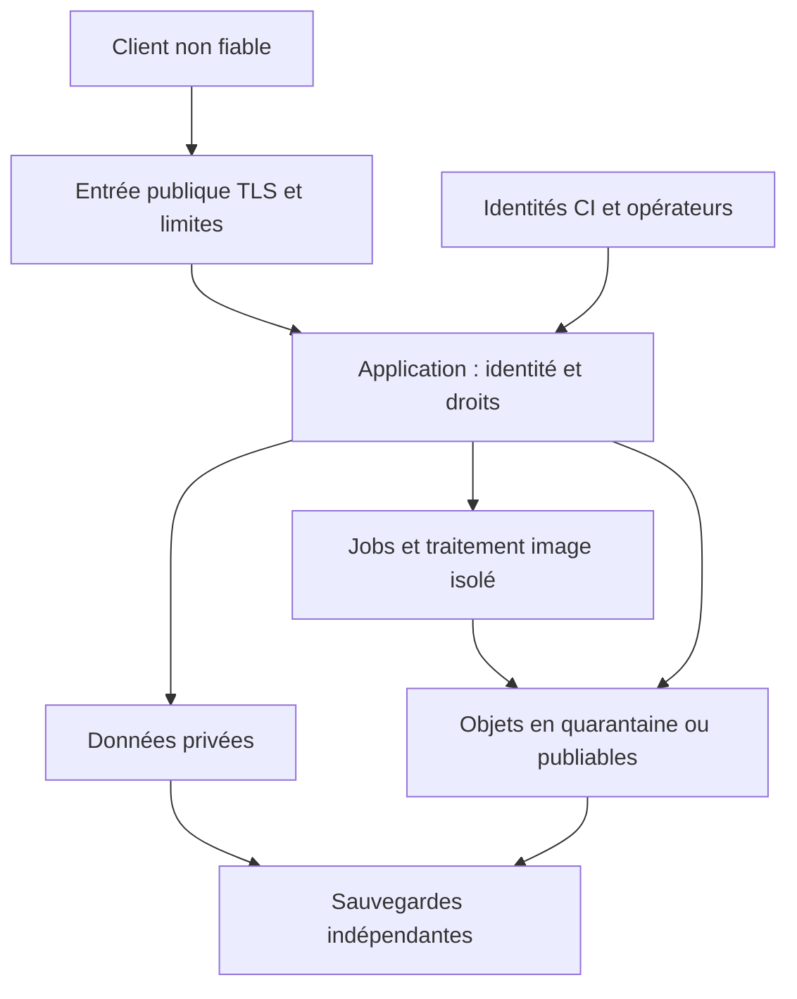

# Sécurité et exploitation — exigences candidates M0

## 1. Identification et statut

| Champ | Valeur |
| --- | --- |
| Objectif | Rendre le pilote texte/image protégeable, livrable, observable et restaurable, avec des critères vérifiables |
| Propriétaire | 14 — DevOps / Cloud / SRE / Security ; aucun reviewer humain attribué |
| Destinataires | 00, 01, 03, 04, 05, 06, 08, 09, 10, 13, 15, 17, 18, 20, 21 |
| Date / version | 29 septembre 2026 / v0.2 ; adaptation du brouillon spécialisé v0.1 au mandat GitHub |
| Base examinée | PR [#2](https://github.com/yyogas/social-network/pull/2), commit `dd7db8c7aec3ea9779e3fb9a9aadec7b3a732957`, branche `documentation/m0-team-coordination` |
| Mandat | M0-TEAM-14 dans les [ordres de travail](../teams/work-orders.md), DIR-010 et DIR-011 du [registre HQ](../project-governance/decision-register.md) |
| Méthode | [Modèle commun](../teams/deliverable-template.md), [plan documentaire](../documentation-plan.md), [gouvernance](../governance.md) |
| Statut | PROPOSÉ ; publication pour revue ne vaut ni approbation spécialisée indépendante ni autorisation d'implémentation |
| Priorité | P0 pour les contrats et preuves nécessaires au pilote ; P1–P3 pour les extensions indiquées |
| Périmètre | Menaces, identité/sessions, accès, médias privés, secrets, livraison, environnements, données opérationnelles, reprise et incidents |
| Exclusions | Fournisseur imposé, code applicatif, IaC, migrations, provisionnement, certification juridique, décision de MVP et promesse de SLA |

Références produit effectivement lues : [vision](../product/product-vision.md), [catalogue](../product/feature-catalog.md), [parcours J01–J07](../product/user-journeys.md). Revue ciblée : [hébergement](../hosting/hosting-comparison.md), [installation](../installation/installation-guide.md), [exploitation](../operations/operations-readiness.md), [stratégie QA](../quality/test-strategy.md), [workflow documentaire](../../.github/workflows/repository-quality.yml). Les fiches ci-dessous complètent ces références sans réécrire leurs procédures ni modifier le registre HQ.

### Faits, hypothèses et delta depuis v0.1

| Nature | Éléments et preuve |
| --- | --- |
| CONFIRMÉ | Mandat documentaire M0 et quatre environnements demandés par le porteur ; règles DIR-010/011 ; fichiers et CI documentaire lus au SHA ci-dessus |
| PROPOSÉ | Toutes les nouvelles mesures, permissions, cibles de reprise et décisions ci-dessous ; classement FEAT repris du catalogue HQ, encore proposé |
| À VÉRIFIER | Capacité/coûts des trois scénarios, méthode d'identité, modèle exact des sessions, charge pilote, conformité des prestataires et faisabilité du multi-zone |
| NON REÇU dans le dossier examiné | Contrats spécialisés approuvés, budgets approuvés, titulaires/remplaçants d'astreinte, matrice finale des accès, politique de rétention, preuves runtime |

Le dépôt et sa CI documentaire existent : les mentions « repository/CI non reçus » de v0.1 sont désormais historiques. 15 est le propriétaire Privacy ; 18 QA est explicitement associé aux preuves. La vision initiale évoquait le live en Phase 2 ; le catalogue place FEAT-033 en Long terme : ce document suit cette proposition GitHub, sans décider la roadmap. Les traces distribuées détaillées ne sont pas une condition universelle du pilote : corrélation et diagnostic minimal suffisent si démontrés. La base « managée » de v0.1 reste une option comparée à l'hôte unique HQ.

Les identifiants REQ-1401–REQ-1410, TEST-1401–TEST-1420, INT-1401–INT-1409, RISK-1401–RISK-1410 et ADR-1401–ADR-1403 sont proposés pour ce livrable ; 17/HQ vérifieront les collisions lors de l'intégration. Ils ne remplacent aucun FEAT ni AC-J existant.

## 2. Contribution, fonctionnalités et phases

Les exigences sont des contraintes transversales sur les FEAT existants, pas dix nouvelles fonctionnalités produit. MVP désigne le candidat pilote à ratifier. Les prérequis inconnus bloquent le lot concerné, pas la rédaction indépendante.

| Exigence | Problème / résultat attendu | Acteurs / préconditions | FEAT et phase proposés | Priorité |
| --- | --- | --- | --- | --- |
| REQ-1401 Identité et sessions | Empêcher usurpation et réutilisation après révocation ; accès récupérable | Membre, Backend ; admissibilité et mécanisme d'identité arrêtés | FEAT-001/002, J01 ; MVP | P0 |
| REQ-1402 Autorisation cohérente | Empêcher l'accès par URL, média, notification ou ancien rôle | Visiteur/membre/modérateur ; matrice visibilité/blocage ratifiée | FEAT-004/012/014/017 ; FEAT-020 si retenu ; MVP | P0 |
| REQ-1403 Images et exports | Aucun octet privé servi à une cible non autorisée ; traitement borné | Auteur/demandeur, workers ; contrat Média et export | FEAT-007/016, J02/J06 ; MVP | P0 |
| REQ-1404 Secrets et privilèges | Révoquer les accès et maintenir les opérations autorisées | Opérateurs, CI, workloads ; propriétaires IAM nommés | FEAT-002/017 et tout pilote ; MVP | P0 |
| REQ-1405 Environnements et livraison | Promouvoir un artefact identifiable sans confondre les environnements | Mainteneur/déployeur ; contrats runtime et migration | Toutes capacités retenues ; MVP | P0 |
| REQ-1406 Sauvegarde et reprise | Récupérer les données cohérentes sans ressusciter droits et contenus retirés | Opérateur reprise, 04/15 ; inventaire et cibles ratifiés | FEAT-004/007/014/016 ; MVP | P0 |
| REQ-1407 Supervision et réponse | Détecter, attribuer et limiter l'incident | Opérateur/astreinte ; responsables et couverture validés | FEAT-019 pour santé technique, tous parcours ; MVP | P0 |
| REQ-1408 Abus et capacité | Limiter saturation, bruteforce et dépenses sans exclure arbitrairement le pilote | Membres/opérateurs ; limites produit et jeu de charge | FEAT-001/002/006/007/013 ; MVP | P0 |
| REQ-1409 Journaux et vie privée | Diagnostiquer sans créer une copie incontrôlée des données privées | SRE, Security, Privacy ; catégories et rétention définies | FEAT-013–017/019 ; MVP | P0 |
| REQ-1410 Capacité/résilience évolutives | Justifier l'évolution par coût, panne et charge mesurés | 03/14/HQ ; objectifs approuvés | MVP : benchmark du scénario retenu ; Phase 2 : multi-zone si besoin, FEAT-024/025/026/028 ; Phase 3 : FEAT-029/030/031 ; International : FEAT-032 ; Long terme : FEAT-033/034 | MVP P0 ; multi-zone P1 ; extensions P2 ; exploration P3 |

Pour les phases ultérieures, le résultat attendu est une revue avant activation : modèle de confidentialité de messagerie, identité appareil, quotas vidéo, accès multigestionnaire ; réconciliation et audit financiers en Phase 3 ; transferts et support par région pour International ; arrêt live et révocation d'intégrations pour Long terme. Aucun service anticipé n'est requis en M0 pour ces capacités. Réexaminer le multi-zone dès M0 si le risque métier l'exige, même à faible charge. Kubernetes, actif-actif multirégion et orchestration avancée restent des options Long terme, non des critères de maturité.

## 3. Flux et modèle de menaces initial

Actifs : identités, droits, contenus privés, preuves de modération, exports, secrets, sauvegardes, historique des releases et disponibilité. Menaces considérées : acteur anonyme abusif, membre malveillant, compte volé, opérateur excessivement habilité, dépendance compromise, erreur humaine et panne. Ce modèle est documentaire ; probabilité réelle et efficacité des contrôles non mesurées.

Les flèches expriment les flux logiques, pas un schéma réseau adopté. Aucun accès Internet direct à DB/cache/backup. Le chemin de diffusion média doit garder le contrôle d'audience à la frontière de livraison ; le CDN ne contourne pas l'application.

| Risque | Flux et scénario | Impact estimé / propriétaire | Contrôle candidat / test | État |
| --- | --- | --- | --- | --- |
| RISK-1401 | Client → identité : credential stuffing, fixation, récupération détournée | Critique / 04+14 | Rotation après authentification/élévation, révocation serveur, limites et récupération vérifiée ; TEST-1401/1402 | OUVERT |
| RISK-1402 | API/CDN → lecteur : ID deviné, audience retirée, cache partagé | Critique / 04+08+14 | Contrôle d'objet à chaque accès, cache privé, invalidation/version de politique ; TEST-1403/1404/1405 | OUVERT |
| RISK-1403 | Opérateur → dossiers : rôle obsolète, support trop puissant | Critique / 10+14 | Portées séparées, MFA, réauthentification, droits réévalués ; TEST-1406 | OUVERT |
| RISK-1404 | Upload → worker : fichier piégé, décompression excessive, import URL/SSRF | Élevé / 08+14 | Quarantaine, limites dimensions/CPU/mémoire, validation/décodage, egress limité ; TEST-1407 | OUVERT |
| RISK-1405 | PR/dépendance → CI → prod : code non fiable ou secret exfiltré | Critique / 14+20+21 | CI de PR sans privilège de prod, promotion par digest, revue, identités limitées ; TEST-1408/1409 | OUVERT |
| RISK-1406 | Panne/corruption → backup : copie inutilisable, clé perdue, suppressions annulées | Critique / 04+14+15 | Copies indépendantes, restauration isolée, journal de suppressions/revocations concilié ; TEST-1410/1411/1412 | OUVERT |
| RISK-1407 | Public → API : saturation, coûts et abus de signalement | Élevé / 09+14 | Limites graduées, quotas serveur, WAF ajusté et capacité bornée ; TEST-1413/1414 | OUVERT |
| RISK-1408 | App → telemetry : secrets, données privées ou injection de logs | Élevé / 13+14+15 | Schéma autorisé, expurgation, limites, accès séparé ; TEST-1415 | OUVERT |
| RISK-1409 | Alerte → personne absente / fournisseur indisponible | Critique / 00+14 | Titulaire et remplaçant, escalade testée, status page indépendante ; TEST-1416/1417 | OUVERT |
| RISK-1410 | Entrée texte/session → service : XSS, CSRF, injection ou mutation concurrente | Élevé / 04+05+14 | Échappement adapté au contexte, requêtes paramétrées, défense CSRF si cookies, contrôle atomique de droit/version ; TEST-1418/1419 | OUVERT |

## 4. Parcours, états, erreurs et reprises proposés

| Exigence | Parcours nominal et transitions | Échecs et cas limites | Réponse / récupération |
| --- | --- | --- | --- |
| REQ-1401 | Anonyme → vérification identité → session active → expirée/révoquée ; activation et récupération sont des challenges distincts à usage unique | Challenge consommé/expiré ; réseau interrompu ; refresh concurrents ; suspension pendant session | Refus générique sans confirmation inutile d'existence ; aucune session avant vérification ; résultat de consommation atomique ; déconnexion répétée sans effet additionnel ; procédure de récupération accessible |
| REQ-1402 | Résoudre acteur/action/ressource/audience/état courant → autoriser ou refuser ; mutation contrôle de nouveau ses préconditions au commit | Rôle retiré, blocage, contenu supprimé, deux modérations concurrentes, moteur de droits indisponible | Refus côté service ; aucun succès optimiste persistant ; conflit explicite ; échec fermé si le droit ne peut être établi ; conservation des routes de recours autorisées |
| REQ-1403 | Upload autorisé → quarantaine → validation → prêt → attaché/publication autorisée → retiré ; export demandé → préparation → disponible → expiré/purgé | Scan en panne, mauvais type, surdimensionnement, doublon de callback, URL expirée, modification d'audience | Jamais de promotion sur erreur ; résultat idempotent, message état exact, reprise bornée ; invalidation des dérivés ; accès export recontrôlé |
| REQ-1404 | Secret créé → actif → rotation préparée → consommateur migré → ancien révoqué ; accès opérateur demandé → autorisé temporairement → expiré | Rotation partielle, fournisseur indisponible, fuite, accès d'urgence | Migration contrôlée ; compromission : révoquer immédiatement le compromis, pas le conserver pour disponibilité ; accès urgence limité, journalisé, revu ; indisponibilité ne donne pas un accès universel |
| REQ-1405 | Artefact construit → staging → vérifié → promotion → observation → réussi ou retour arrière | Déploiement concurrent, migration échouée, readiness en échec, DB incompatible | Verrou par environnement, arrêt publication, version précédente si compatible ; sinon maintenance et procédure corrective/reprise données validée ; pas de rollback aveugle |
| REQ-1406 | Sauvegarde demandée → en cours → complète → intégrité vérifiée ; restauration demandée → isolée → contrôlée → conciliée → ouverture autorisée | Backup incomplet, clé absente, backup ancien, journal d'effacement manquant, jobs déjà exécutés | Échec explicite, alerte ; aucun point partiel présenté restaurable ; rester isolé en cas de droits/suppressions non conciliés ; éviter renvoi des emails et exécution double de jobs |
| REQ-1407 | Sonde/alerte → incident ouvert → pris en charge → mitigé → résolu → postmortem | Aucun répondant, perte telemetry, fausse alerte, reprise partielle | Escalade remplaçant ; source externe de santé ; incident maintenu tant que validation insuffisante ; communication sans données privées |
| REQ-1408 | Requête authentifiée ou anonyme → contrôle quota/charge → traitement ou refus temporaire | IP partagée, seuil contourné, saturation DB/queue, couche DDoS contournée par origine | Limites par ressource/compte/contexte, pas IP seule ; refus explicite et délai de reprise contractuel ; bornes taille/concurrence ; rejet excessif mesuré |
| REQ-1409 | Événement → minimisation → émission → stockage limité → purge selon politique | Collecteur indisponible, champ secret, forte cardinalité, audit d'action sensible impossible | Tampon borné, alerte sur perte ; rejeter champs interdits ; définir les actions privilégiées dont la preuve durable est préalable ; ne pas bloquer tout le service sur un log diagnostic perdu |
| REQ-1410 | Charge représentative → mesures → coût → option → revue → essai de panne/migration → déploiement autorisé | Résultat non reproductible, p95 hors cible, replica en retard, absence de fencing | Ne pas annoncer la capacité ; conserver traces et jeu de charge ; limiter ouverture ou corriger avant ajout de ressources |

Codes conceptuels à confronter à 04 : `UNAUTHENTICATED`, `FORBIDDEN`, `RESOURCE_UNAVAILABLE`, `CONFLICT`, `RATE_LIMITED`, `DEPENDENCY_UNAVAILABLE`, `PROCESSING_FAILED`. Mapping HTTP et distinction 403/404 selon risque d'énumération à ratifier. La réponse expose code, message localisable et identifiant de corrélation ; le détail interne reste dans les journaux autorisés. Un retry ne doit jamais contourner une permission devenue insuffisante.

UX/accessibilité (02/05/10/16) : états texte lisibles au lecteur d'écran, focus sur erreur utile, conservation des champs non secrets après erreur, aucune copie de secret dans un message ; status page compréhensible au clavier, horodatage et composant affecté. Les délais de session et réauthentification doivent être expliqués. L'accessibilité des challenges et le taux de faux refus font partie de TEST-1420. Les états « vide » et « chargement » concernent dashboards/files de jobs ; un inventaire vide n'est pas un système sain et une métrique manquante n'est pas zéro.

### Authentification et sessions : options à faire ratifier

Proposition initiale pour le web : session serveur avec identifiant opaque et cookie `Secure`, `HttpOnly`, portée réduite et `SameSite` compatible avec les parcours retenus ; protections CSRF sur mutations par cookie, sans se limiter à `SameSite`. Une alternative par jetons doit préciser durée, rotation, révocation, audience et stockage client. Aucun secret de session durable dans une URL ou un log. Méthode d'identité (mot de passe, passkey ou fédération) et durées idle/absolue restent ouvertes avec 04/05/06/15. Si mot de passe retenu, stockage via fonction dédiée et paramètres revus/testés, aucun chiffrement réversible comme stockage normal. Récupération ne doit pas contourner un MFA administrateur.

Proposer réauthentification pour export, changement de moyen de récupération et actions opérateur sensibles ; le rôle et le statut du compte sont vérifiés côté serveur. Suspendre un compte doit révoquer les capacités ciblées, tout en préservant le recours ou les demandes privacy expressément autorisés. Le modèle concret et les messages restent à faire valider par 09/10/15.

## 5. Permissions candidates

Les rôles décrivent des capacités à examiner, pas des affectations ni un RBAC adopté. Le propriétaire d'infrastructure ne reçoit aucun droit métier implicite de modération. Une permission de lecture n'accorde ni export ni restauration.

| Acteur | Action / ressource | Portée / règle proposée | Refus / preuve attendue |
| --- | --- | --- | --- |
| Anonyme | Auth/récupération et contenus ouverts si politique le permet | Pas de données de compte privées ; limites avant création de session | Aucune donnée privée ni révélation inutile d'existence |
| Membre propriétaire | Profil, contenu, demande d'export | Session valide, propriété et état vérifiés ; réauth sur opérations sensibles | Autre propriétaire refusé par service et URL objet |
| Autre membre | Lire/interagir | Audience, blocage et état courant ; aucune portée globale par défaut | Cache, aperçu et API suivent le même refus |
| Bloqué/suspendu | Interaction/lecture et recours | Effets déterminés par 09/15 ; exceptions explicites pour recours | Aucun contournement via ancienne session ou média |
| Modérateur/support | Lire dossier, agir, consulter preuves | Dossier et champ nécessaires, action distincte de lecture, MFA proposé ; portée locale si communauté | Support ne devient pas admin ; retrait de rôle effectif en session |
| SRE lecture | Santé technique / journaux expurgés | Lecture sur environnements attribués | Pas de secret, export utilisateur ni dossier métier |
| Déployeur / identité CI | Promouvoir artefact | Branche/environnement approuvés, digest attendu, privilège court | PR non fiable incapable d'obtenir identité prod |
| Gestionnaire secrets | Rotation/révocation | Identité et secret attribués ; pas d'accès général aux données applicatives | Audit sans valeur secrète |
| Opérateur reprise | Restaurer dans une cible isolée | Autorisation explicite sur jeu et cible ; ouverture exige contrôle de cohérence/droits par responsables | Pas d'écrasement prod sans procédure ; preuve séparée d'autorisation |
| Accès d'urgence | Intervention bornée | Moyen de secours protégé, motif, alerte, durée, revue après usage | Aucune utilisation anonyme ou permanente |

## 6. Données et cycle de vie

Toutes les durées restent NON REÇUES, propriétaire 15 avec 14/04 ; aucune durée légale inventée. Les exports ci-dessous désignent l'extraction d'une catégorie par une personne habilitée, pas son inclusion automatique dans l'export utilisateur.

| Catégorie / origine | Champs nécessaires et finalité | Stockage et accès proposés | Modification, export, suppression et sauvegarde |
| --- | --- | --- | --- |
| Sessions / authentification | ID technique, acteur, émission, expiration, révocation, niveau de vérification ; IP limitée si nécessaire et validée | Stockage protégé ; Backend, diagnostic Security limité ; jetons bruts exclus des logs | Révocation serveur ; rotation ; export expurgé ; restauration invalide les anciennes sessions selon contrat, jamais réactivation implicite |
| Secrets / gestionnaire | Référence, version, propriétaire, consommateurs, dates ; valeurs uniquement dans coffre | Accès machine limité ; audit des accès ; clés de récupération indépendantes | Rotation/révocation ; export exceptionnel contrôlé ; effacement des anciennes versions selon nécessité de déchiffrement backup |
| Journaux sécurité/audit | Acteur technique, action, cible opaque, résultat, heure UTC, corrélation, motif codifié | Collecteur protégé, accès 14/10 selon usage ; séparation des notes métier | Append et correction traçable ; extraction expurgée ; purge documentée ; backup ne prolonge pas silencieusement la rétention |
| Métriques/traces | Route normalisée, latence, erreur, ressources, queue ; aucune charge utile privée | Backend d'observation ; 14, agrégats autorisés pour 13 | Échantillonnage, plafonds de cardinalité, export agrégé, rétention/purge ; IP/identifiants utilisateurs absents des labels ordinaires |
| Sauvegardes DB/objets | Manifest, horodatage du dernier état récupérable, version schéma, versions objets, checksum, clé référencée | Stockage indépendant du primaire et protégé contre suppression ; 14/04 autorisés | Cycles de vie selon 15 ; accès/restauration journalisés ; expirations et conservation exceptionnelle motivées |
| Registre des effacements/restrictions | Référence minimale opaque, action, version/date, portée pour conciliations | Source protégée survivant à la perte du primaire ; design avec 04/15 | Minimiser et purger selon politique ; rejouer avant ouverture ; pas de reconstruction depuis logs incomplets |
| Exports utilisateurs | Demandeur, périmètre validé, état, objet, date d'expiration | Objets privés séparés ; droit vérifié au téléchargement | Purge/expiration ; ne pas inclure secrets ou données tierces ; copie backup contrôlée avec 15 |
| Releases/configuration | Commit, digest, dépendances, schéma, auteur opération, état | Git/registre artefacts, aucune valeur secrète | Historique et rollback traçables ; export technique ; rétention compatible avec restauration |

## 7. Contrats d'exploitation candidats

Noms `SECIF-14-*` locaux v0.1 proposés pour discussion avec producteurs, sans endpoint ou transport imposé. Schémas ci-dessous conceptuels. Timeout, budget de retry et limites numériques sont À VÉRIFIER avec 03/04/08 avant implémentation ; les conditions de sécurité sont explicites. Aucun « retry infini » implicite.

| Interface / producteur → consommateur | Entrée → sortie et validation | Identité / droit | Erreur, timeout/retry, idempotence et concurrence | Audit, compatibilité et test |
| --- | --- | --- | --- | --- |
| SECIF-14-01 health/readiness ; application → sonde | Type de sonde → vivant/prêt/dégradé + dépendances internes autorisées ; détails privés non exposés publiquement | Sonde interne identifiée ; public reçoit état synthétique | Timeout court borné ; retry de sonde limité ; lecture idempotente ; liveness ne dépend pas de DB pour éviter boucle de redémarrage ; readiness distingue dépendance critique et facultative | Version du schéma ; pas de stack trace publique ; TEST-1416 |
| SECIF-14-02 déploiement ; pipeline → plateforme | Release ID, commit, digest, environnement, version schéma, autorisation → état/version réellement active | Identité courte bornée au repo/ref/environnement ; promotion distincte de PR CI | Conflit si autre release active ; verrou par environnement ; retry même release/digest, pas nouvel artefact ; timeout aboutit à état à réconcilier, pas succès supposé | Corrélation release/job, transitions durables ; compatibilité app/schéma validée ; TEST-1408/1409 |
| SECIF-14-03 backup/restore ; ordonnanceur/opérateur → stockage et DB | Run ID, périmètre, cible, point demandé, versions clés → manifest, point récupérable, état contrôles | Écriture backup séparée de suppression ; restauration autorisée et isolée | Échec si clé/manifest manquant ; reprise contrôlée par run/cible ; pas d'écrasement concurrent ; fenêtre max déclenche alerte | Trace opérateur et checksums ; versions schéma/objets ; TEST-1410/1411/1412 |
| SECIF-14-04 révocation ; compte/modération → contrôles API/média | Acteur/cible/action, version politique, date, correlation ID → état effectif par consommateur | Producteur métier autorisé ; le consommateur ne fait pas confiance à une valeur client | Événement répété sans effet supplémentaire ; ignorer version plus ancienne ; événement retardé ne rétablit pas un droit ; tant que droit non établi, refuser | Compatibilité par version d'événement ; aucune URL secrète ; TEST-1403/1404/1406 |
| SECIF-14-05 rotation ; gestionnaire → workload | Référence/version, fenêtre validée → version chargée et résultat | Workload limité à ses secrets | Reprise même version ; validation avant retrait d'une ancienne version non compromise ; fuite impose révocation immédiate ; ne pas désactiver TLS pour reprendre | Journal sans valeur ; ancien lecteur interdit après retrait ; TEST-1412 |
| SECIF-14-06 alerte ; observation → répondant/status page | Incident ID, composant, sévérité, impact, heure, corrélation → accusé et statut | Canal et opérateur habilités ; publication publique distincte | Déduplication incident/composant ; retry borné puis autre canal ; absence d'accusé escaladée ; fins d'incident ordonnées | Historique interne expurgé ; version format ; TEST-1416/1417 |

Les besoins en files durables et outbox restent à décider par 03/04. Redis utilisé comme cache peut être reconstruit ; s'il porte jobs ou sessions, garanties de perte, replay et révocation doivent être explicites. Une restauration du cache ne vaut pas restauration du métier. Les pages publiques dégradées éventuelles ne donnent jamais accès aux données privées sans contrôle.

## 8. Exigences opérationnelles ciblées et limites

Environnements : local/dev sur fixtures synthétiques ; staging isolé de prod avec mêmes artefacts et mécanismes d'autorisation ; prod avec identités distinctes. Une topologie staging réduite ne démontre pas une bascule multi-zone. Les restaurations de vraies données se font dans une enclave autorisée, pas dans un dev partagé.

CI proposée pour le futur runtime : tests requis → analyse dépendances/secrets/images → build identifiable et inventaire des dépendances → staging → tests de migrations/permissions → publication autorisée → surveillance → retour arrière si critère franchi. Les dépendances sont verrouillées et mises à jour sous revue. Le workflow actuel contrôle seulement la documentation, les noms/liens et son validateur ; le détecteur de marqueur de clé privée n'est pas un scanner complet de secrets. Protections de branche effectives À VÉRIFIER par 20/21, pas certifiées par la présence du YAML.

Conteneurs/OS proposés : images minimales, processus non privilégié, capacités réduites, ressources bornées, volumes et réseau limités, pas de socket Docker partagé avec application/CI non fiable. Hôtes patchés avec inventaire versions/fin de support et essai rollback. OS/runtime/architecture CPU de production NON REÇUS ; `ubuntu-24.04` est uniquement le runner documentaire observé. Aucun achat, version runtime exacte ou script d'installation applicative n'est livré.

WAF/DDoS : filtrage et limites en entrée, origine protégée du contournement direct, TLS, taille de requête et concurrence bornées ; règles observées avant durcissement pour contrôler faux positifs et accessibilité. WAF ne remplace ni validation d'entrée ni autorisation. Absence de WAF avancé payant ne valide pas son omission : couverture fournisseur/coût et risque résiduel à documenter avec HQ.

Sauvegarde/reprise : RPO = perte maximale acceptable mesurée au dernier état réellement récupérable ; RTO = délai depuis déclaration du sinistre jusqu'au retour vérifié du parcours critique, acquisition d'infrastructure/clé incluse. Choisir un point DB et des versions d'objets compatibles, contrôler références/dérivés, droits et effacements ; ne pas rejouer notifications ou actions externes déjà terminées. Sauvegarde chiffrée indépendante du primaire, permissions de suppression séparées, protection contre effacement à étudier avec 15. Réplication et snapshot réussi seuls ne prouvent pas la reprise. Test avant pilote puis périodicité à convenir selon risque et changements. Rétention 7/14/30 jours du comparatif HQ = propositions, pas délais applicables adoptés.

Révocation média : une URL signée valable et un objet déjà en cache peuvent rester lisibles après blocage. Avant adoption, 04/08 doivent fixer la borne d'invalidation, le contrôle au point de livraison et le comportement des liens existants. Pour une exigence de refus immédiat, privilégier une autorisation réévaluée à la livraison ; ne pas prétendre que le TTL seul satisfait l'exigence. Les copies déjà téléchargées ne sont pas techniquement récupérables par la plateforme : wording avec 02/15.

## 9. Revue des trois niveaux HQ et contradictions

Revue documentaire du [comparatif daté](../hosting/hosting-comparison.md), sans revalidation des prix, stock, devis ni benchmark. Les enveloppes EUR et USD restent distinctes ; staging, personnel et astreinte restent exclus des montants HQ.

| Niveau HQ | Ce que le modèle permet d'étudier | Fragilité principale | Avis spécialisé proposé / condition |
| --- | --- | --- | --- |
| Minimum : 1 hôte app/DB/workers, 1 000 comptes de test, pointe 10 req/s, RPO 24 h/RTO 8 h | Coût matériel initial faible, jeu de charge pilote | Panne unique, compétition mémoire/disque, exploitation humaine ; backup quotidien insuffisant si budget perte < 24 h | Option acceptable à examiner pour pilote limité seulement après acceptation explicite de la perte/interruption, restauration mesurée, stockage média séparé et répondant disponible |
| Intermédiaire : 2 apps, 1 DB, 1 worker, pointe 100 req/s, RPO 1 h/RTO 4 h | Séparation et capacité à mesurer | DB/worker/entrée toujours potentiellement uniques ; archive de journaux à surveiller | Option de croissance ; ne pas l'appeler HA ; prouver recovery, pool connexions, idempotence jobs et coût d'exploitation |
| Premium : 3 apps, 2 DB, 2 workers, pointe 1 000 req/s, RPO 15 min/RTO 1 h | Répartition et objectifs plus exigeants | Deux DB ne définissent pas quorum/fencing ; zones et entrée non garanties | Architecture de panne à produire par 03/14 ; test réseau/zone, prévention split-brain et cohérence avant engagement |

**C-14-01 — exploitation/coût :** v0.1 proposait PostgreSQL et conteneurs managés ; HQ chiffre des VM dont une DB colocalisée au minimum. Les budgets HQ ne financent pas automatiquement l'option managée. Arbitrage ADR-1401 ; les deux options restent ouvertes.

**C-14-02 — reprise :** v0.1 proposait 1 h/4 h pour le pilote ; HQ propose 24 h/8 h au minimum et 1 h/4 h à l'intermédiaire. Arbitrage ADR-1402 ; la fréquence d'une tâche de sauvegarde ne prouve pas son RPO effectif.

**C-14-03 — restriction :** J02/J04 exigent le refus après restriction ; des URL signées autonomes survivant au changement peuvent contredire cet objectif. Contrat exact NON REÇU, risque potentiel à instruire par INT-1404 ; aucun défaut d'implémentation n'est affirmé.

Installation/exploitation HQ : distinction correcte entre dépôt documentaire et application absente ; migrations destructives correctement distinguées d'un rollback. Compléments nécessaires : version de clé et récupération hors primaire, manifeste DB/objets, conciliation suppressions/révocations, comportement des jobs, titulaires d'alerte, limites CI. Ces compléments sont ici proposés pour revue ciblée ; les autres documents ne sont pas approuvés globalement par cette analyse.

## 10. Décisions importantes proposées

Identifiants ADR ci-dessous provisoires, à inscrire par HQ après arbitrage ; aucun fichier de décision approuvée créé. Migration/rollback détaillés dépendront du choix réel.

| Champ | ADR-1401 — Hébergement pilote | ADR-1402 — Reprise soutenable | ADR-1403 — Sessions et privilèges |
| --- | --- | --- | --- |
| Statut / phase / priorité | PROPOSÉ / MVP / P0 | PROPOSÉ / MVP / P0 | PROPOSÉ / MVP / P0 |
| Objectif | Exploiter le pilote avec moyens disponibles | Perte et interruption acceptables prouvées | Révocation et accès sensibles cohérents |
| Problème | Coût humain et disponibilité équipe inconnus | Deux cibles incompatibles selon scénario | Méthode auth et durées non arrêtées |
| Solution candidate | Région initiale unique ; préférence managé si coût total et fonctions compatibles ; garder VM comme option | Étudier 1 h/4 h, comparer au 24 h/8 h HQ ; retenir uniquement après acceptation métier et exercice | Session serveur web proposée ; MFA opérateurs, portées séparées, réauth sensible ; contrat de révocation commun |
| Alternatives / motifs | VM unique : économique mais responsabilité forte ; multi-zone : disponibilité potentielle mais coût ; Kubernetes : charge d'exploitation sans besoin démontré ; aucune rejetée officiellement | Backups quotidiens : perte potentielle supérieure ; PITR : clés/journaux/stockage à exploiter ; HA ne remplace pas backup | Jetons/fédération/passkeys : à comparer selon clients et récupération ; aucun choix rejeté officiellement |
| Dépendances | INT-1401/1402/1406 ; 00/03/15 | INT-1401/1403/1406/1408 ; 01/04/15/18 | INT-1403/1405/1406 ; 04/05/06/09/10/15 |
| Risques / propriétaire | Coût fournisseur ou exploitation sous-estimé ; 14/HQ | RTO invérifiable, restauration privée exposée ; 14/04 | Session persistante après retrait de droit, récupération MFA détournée ; 04/14 |
| Impact business | Dépense directe et temps humain ; pas de prix managé inventé | Arbitrage perte de contributions / coût / confiance | Friction opérateurs et support récupération |
| Impact technique | Déploiement, réseau, sauvegarde, portabilité ; pas de stack forcée | DB/objets/journaux/clé et procédures | Auth, stockage sessions, contrôles consommateurs et compatibilité mobile |
| Autorité | HQ après 03/14/15, budget | HQ après 01/04/14/15/18 | HQ après propriétaires métier, 04/14/15 |
| Réexamen / rollback | Nouveau volume/coût ou besoin disponibilité ; migration et retour à version validée | Échec exercice ou changement de données ; rester isolé plutôt qu'ouvrir une reprise incohérente | Changement client/risque ; compatibilité et révocation de sessions lors migration, pas retour à des secrets compromis |

## 11. Incidents, service et conditions d'ouverture

Procédure candidate : détecter → qualifier périmètre et sévérité → nommer responsable et remplaçant → contenir selon runbook → préserver preuves minimales → communiquer l'état → restaurer/corriger → vérifier parcours/droits/données → résoudre → postmortem et non-régression. Toute suspicion de fuite est transmise à 15 pour qualification des obligations ; 14 ne fixe pas de délai juridique. Une interruption technique ne justifie pas de publier contenu privé ou identité du signalant.

Sévérité proposée : critique pour fuite/prise de privilège/perte de données ou indisponibilité générale ; majeure pour dégradation d'un parcours essentiel ; mineure pour dégradation isolée contournable sans risque de droits. Titulaires, couverture horaire et délais d'accusé NON REÇUS de HQ ; aucune astreinte 24/7 promise. Sans répondant, limiter les horaires/participants ou reporter ouverture après arbitrage. Status page sur domaine de panne distinct, accessible en cas de panne application ; modification réservée à rôle communication d'incident.

SLI candidats : taux de succès des parcours auth/publication/lecture autorisée ; latence p95/p99 par route normalisée ; âge du plus vieux job ; âge du dernier point restaurable ; taux d'échecs upload ; erreurs de permissions inattendues. Distinguer refus métier normal et panne, suivre séparément les refus d'abus et faux positifs. SLO, fenêtre, seuils d'alerte et politique de budget d'erreur à définir avec 01/18 ; aucune disponibilité chiffrée garantie. Une sonde externe doit signaler la perte de supervision interne.

Ouverture pilote conditionnée à : périmètre/pays/âge ratifiés ; droits et retrait de visibilité testés ; accès opérateurs nominatifs protégés ; CI/promotions et versions traçables ; sauvegarde/clé et restauration conciliée démontrées ; migration/retour arrière testés ; limites et jeu de charge documentés ; alerte réellement reçue ; répondants et status page ; avis 15 et revue indépendante 18/21. Un test documentaire réussi ne lève aucune de ces conditions runtime.

## 12. Acceptation et vérification à construire

Tous les cas ci-dessous sont **PLANNED** ; ils ne sont pas exécutables aujourd'hui. Blocage commun : implémentation et environnement applicatifs absents de la base examinée. Fixtures futures : comptes fictifs A/B, opérateur limité O, communauté fictive C si retenue, image et export synthétiques, secrets factices. Aucun credential réel nécessaire à la rédaction. Une preuve future contiendra date, environnement, SHA, version contrat, commande, résultat et logs expurgés.

| Critère / test | Besoin et référence HQ | Étant donné / action / résultat attendu | Type ; dépendance à lever |
| --- | --- | --- | --- |
| AC-1401 / TEST-1401 | REQ-1401 ; AC-J01-03 | Session A active ; révoquer puis rejouer/rafraîchir ; aucune action protégée permise | API ; contrat révocation 04 |
| AC-1402 / TEST-1402 | REQ-1401 ; AC-J01-02/04 | Challenge expiré/consommé ; replay ou deux validations simultanées ; aucun double accès ni information privée | API/concurrence ; mécanisme récupération |
| AC-1403 / TEST-1403 | REQ-1402 ; AC-J02-04 | B non autorisé ; lire par détail/fil/URL/aperçu ; aucun contenu ou dérivé privé | API/E2E ; matrice audience |
| AC-1404 / TEST-1404 | REQ-1402/1403 ; AC-J02-05, AC-J04-01 | B possédait lien valide ; A restreint/bloque ; accès origin/cache/CDN respecte délai et règle ratifiés | Intégration ; contrat invalidation |
| AC-1405 / TEST-1405 | REQ-1402 ; AC-J03-05 | Notification préparée puis droit retiré ; livraison/lecture ; aucun aperçu sensible interdit | Intégration ; contrat notification |
| AC-1406 / TEST-1406 | REQ-1402/1404 ; AC-J05-01, AC-J07-02/03 si retenu | O perd son rôle ; lecture/action sur dossier ; refus effectif même dans session ouverte, recours autorisé préservé | API ; 09/10 matrice |
| AC-1407 / TEST-1407 | REQ-1403 ; AC-J02-02 | Image invalide/surdimensionnée ou scan absent ; traitement ; quarantaine/refus et limites ressources, aucune publication | Intégration ; 08 limites |
| AC-1408 / TEST-1408 | REQ-1405 ; DIR-010 | PR non fiable ; demander identité prod ou artefact modifié ; refus et absence de secret dans logs/artefacts | CI/sécurité ; 20 pipeline |
| AC-1409 / TEST-1409 | REQ-1405 | Release compatible puis migration incompatible simulée ; échec ; retour précédent uniquement si données compatibles, état d'arrêt sinon | Staging ; 04 migration/20 |
| AC-1410 / TEST-1410 | REQ-1406 | Primaire indisponible ; restaurer DB/objets dans cible isolée ; intégrité et parcours critiques vérifiés, RPO/RTO réellement mesurés | Reprise ; 04/08/14/18 manifest |
| AC-1411 / TEST-1411 | REQ-1406 ; AC-J06-03/04 | Backup antérieur à effacement/retrait/révocation ; restaurer ; aucune réapparition interdite ni ancien pouvoir, pas de double job externe | Reprise/privacy ; registre durable 04/15 |
| AC-1412 / TEST-1412 | REQ-1404/1406 | Rotation/compromission simulée ; retirer ancienne identité et restaurer backup chiffré ; ancien accès refusé et chemin de déchiffrement autorisé prouvé | Sécurité/reprise ; 14 gestion clés |
| AC-1413 / TEST-1413 | REQ-1408 | Rafale d'auth/uploads et utilisateurs sur IP commune ; appliquer limites ; refus borné sans fuite et faux positifs évalués | Charge/abus ; quotas 01/04/09 |
| AC-1414 / TEST-1414 | REQ-1408/1410 | Jeu de charge d'un scénario HQ ; exécuter lectures/écritures/media ; latence, erreurs, mémoire, coût et limites mesurés | Charge ; 03/18 objectifs |
| AC-1415 / TEST-1415 | REQ-1409 ; FEAT-019 | Entrées contenant secrets factices/texte privé ; erreurs et traces ; absence de ces valeurs, accès lecture limité, purge conforme | Intégration/privacy ; 13/15 champs |
| AC-1416 / TEST-1416 | REQ-1407 | DB ou collecteur indisponible ; sondes/alerte ; état exact, réception/escalade démontrée sans boucle de redémarrage | Exploitation ; répondants 00/14 |
| AC-1417 / TEST-1417 | REQ-1407 | Application hors service ; incident simulé ; status page indépendante mise à jour et chronologie expurgée | Exercice ; rôles et canaux |
| AC-1418 / TEST-1418 | REQ-1401/1402 ; J01/J02 | Texte et requêtes malveillants, origine non autorisée ; mutation/rendu ; aucune exécution/injection ni CSRF avec la session choisie | Sécurité ; 04/05 mécanismes |
| AC-1419 / TEST-1419 | REQ-1402 ; AC-J03-02, AC-J05-02/03 | Deux mutations et retrait de droit concurrents ; exécuter ; invariant métier conservé, aucun double effet ou succès mensonger | Concurrence ; contrats 04/09 |
| AC-1420 / TEST-1420 | REQ-1403/1407 ; AC-J06-01/02 et FEAT-021 | Export fictif ou challenge/alerte ; compte B/lien expiré refusés ; parcours erreur/reprise utilisable au clavier dans langue retenue | API/E2E/accessibilité ; 02/05/10/15/16 |

## 13. Questions, dépendances et transmissions ciblées

Émetteur : 14. Statut de chaque ligne : **À TRANSMETTRE** à la discussion propriétaire tant qu'aucun envoi n'est attesté. Référence commune : ce document v0.2, sections indiquées ; seules ces parties nécessitent une revue. La publication d'une PR ne prouve pas la lecture par chaque discussion.

| ID | Destinataire | Question et livrable demandé | Blocage réel / delta |
| --- | --- | --- | --- |
| INT-1401 | 00/01/19 | Confirmer cohortes/volume, budget complet, couverture humaine, perte/interruption acceptables ; fiche pilote et répondants | Bloque achat, objectifs et ouverture ; §9–11 ; ne bloque pas spécification |
| INT-1402 | 03 | Comparer VM/managé et domaines de panne ; ADR avec entrée réseau, DB/cache/jobs, OS/runtime candidats | Bloque déploiement ; §3/7/9 ; aucune demande de refonte globale |
| INT-1403 | 04/05/06 | Contrat identité/récupération/session, révocation, permissions atomiques, migrations et replay jobs | Bloque implémentation auth/reprise ; §4–7 ; demander valeurs et comportements, pas choix implicites |
| INT-1404 | 08/04 | Définir invalidation audience/blocage et URL existantes, quarantaine, limites, manifest objets | Bloque diffusion privée et restauration ; C-14-03, TEST-1404/1407/1410 |
| INT-1405 | 09/10 | Séparer lecture/preuves/action/export/recours, retrait de rôle, suspension et accès d'urgence | Bloque pouvoirs opérateurs ; §5, TEST-1406/1419 |
| INT-1406 | 15 | Résidence prestataires/données, catégories/durées, effacement en backups, récupération et incident ; analyse datée ciblée | Bloque politiques définitives et ouverture ; §6/8/11 |
| INT-1407 | 13 | Champs de santé versus analytics, cardinalité, agrégation, conditions de collecte | Bloque instrumentation personnelle ; santé sans données privées peut être spécifiée ; §6/11 |
| INT-1408 | 18 | Reprendre TEST-1401–1420, préciser fixtures/preuves et exercices reprise/incident | Bloque validation runtime, pas rédaction ; §12 |
| INT-1409 | 17/20/21 | Indexer ce fichier, vérifier IDs, préparer contrôles CI et review de cette PR ; confirmer protections réelles | Bloque merge/release selon règles ; §8/14 ; pas d'auto-validation indépendante |

## 14. Compte rendu de l'étape

1. **Décisions prises / à valider :** rédaction et classement local achevés ; aucune adoption cloud, stack, permission ou RPO/RTO. ADR-1401/1402/1403 et C-14-01/02/03 à arbitrer avec HQ.
2. **Livrable :** ce fichier v0.2 au chemin propriétaire du mandat M0-TEAM-14, basé sur PR #2 au SHA cité. Référence exacte de publication et résultats des contrôles consignés dans la PR de contribution ; aucune fusion présumée.
3. **Vérification :** relecture ciblée des documents cités ; 20 scénarios runtime PLANNED, aucun test applicatif exécuté. Les contrôles du dépôt, s'ils réussissent, prouvent seulement leur périmètre documentaire ; le compte rendu de PR fournit commandes/environnement et résultats réellement observés.
4. **Questions ouvertes :** hébergement/coût humain, cibles reprise, sessions/MFA/récupération, invalidation des médias, rétention et répondants (§13).
5. **Dépendances :** INT-1401–1409 À TRANSMETTRE ; aucun avis consommateur ou destinataire supposé reçu.
6. **Risques / limites :** RISK-1401–1410 OUVERTS ; analyse documentaire initiale, pas audit de système déployé ; prix HQ non revalidés et capacités non mesurées.
7. **Suite / HQ :** revue indépendante 21 et ciblée 03/04/08/09/10/15/18, arbitrages documentés, normalisation 17, puis autorisation d'un lot précis. Priorité à C-14-01/02 et au contrat de retrait d'accès média. La fusion documentaire n'autorise pas la production.

## Sources techniques de référence

Consultées le 29 septembre 2026, pour guider les propositions à revoir et non pour attester une implémentation : [OWASP Session Management](https://cheatsheetseries.owasp.org/cheatsheets/Session_Management_Cheat_Sheet.html) (cycle de session et cookies), [OWASP Authorization](https://cheatsheetseries.owasp.org/cheatsheets/Authorization_Cheat_Sheet.html) (contrôles côté service), [OWASP Secrets Management](https://cheatsheetseries.owasp.org/cheatsheets/Secrets_Management_Cheat_Sheet.html) (cycle de vie des secrets). Le registre HQ reste l'autorité sur les choix du projet.
